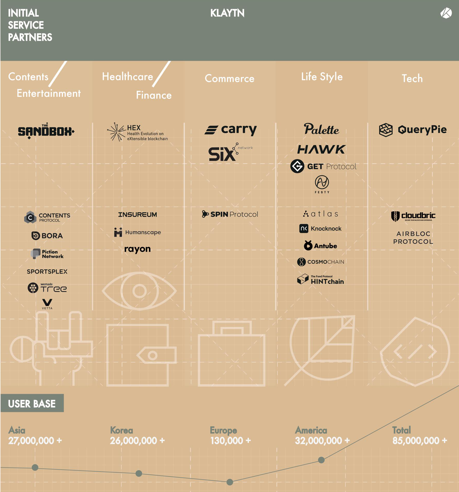

Klaytn Mainnet이 오픈된 후 일정 기간 내에(3-6개월 이내) 온보딩할 서비스를 Initial Service Partner(ISP)라고 하며 Klaytn 생태계의 중요한 한 축을 이룹니다. 2018년부터 ISP 파트너쉽 프로그램을 가동하면서 real use-case를 만들어 낼 수 있는 양질의 견고한 서비스 파트너들을 합류시켜 왔습니다. 전세계의 블록체인 서비스를 리뷰하면서 도박이나 사행성 관련 프로젝트를 배제하고 300개 이상의 프로젝트를 개별 인터뷰하며, 지금까지 40개 정도의 서비스 파트너들을 확보했습니다. 이들은 글로벌 13개국에 걸쳐 있으며, 1/3 가량이 한국 이외 지역의 서비스입니다. 아래 그림이 Klaytn 메인넷 런칭 시점까지 확보된 40여개 ISP들을 보여 줍니다.

ISP 선정 기준은 매우 엄격합니다. 사용자 기반을 가지고 있으면서 이를 기반으로 블록체인 서비스를 하는 곳을 우선적으로 선정했습니다. 그리고 일반 사용자에게 실제 사용 가치를 제공할 수 있는 서비스만을 선정하고, 다양한 분야 서비스를 골고루 확보하기 노력하였습니다. 게임, 엔터테인먼트, 헬스케어, 금융, 커머스, 결제, 라이프스타일 등 다양한 분야에 걸쳐 의미있는 서비스들이 포진해 있습니다. 그리고 서비스 파트너들 중에는 자체 토큰을 발행하는 대신 KLAY를 활용하는 곳들이 있으며 KLAY Pay BApp이라고 부릅니다. 현재는 주로 게임류가 많은데, 점점 범위를 확대하려고 합니다.

특히 한국 ISP들은 한국에서 규모있는 사업을 하고 있는 기업들의 리버스 블록체인 프로젝트인 경우가 많습니다. 위메이트 트리(위메이드), 컨텐츠 프로토콜(왓차), 캐리 프로토콜(스포카), 코스모체인(후이서울), 스핀 프로토콜(우먼스톡) 등이며 공격적으로 블록체인 사업을 시도하고 있습니다. 또한 PASSPORT(Hi)는 홍콩의 유니콘 기업으로서 블록체인 기반의 대규모 사업을 준비 중인데 Klaytn을 플랫폼으로서 선정하였습니다. 이처럼 ISP 대부분은 제로 베이스에서 시작한 곳보다는 사업 기반을 확보한 곳들이며 그들의 사용자 기반이 Klaytn에 유입되면서 서로간 시너지를 만들어 낼 수 있을 것으로 기대합니다.

메인넷 런칭 시점 40개 정도의 ISP들이 준비되고, 2019년 말까지 100개까지 확대하는 것을 목표로 합니다. ISP들이 양질의 서비스를 온보딩시키기 위한 Klaytn의 전략적인 노력이라면 메인넷 이후에는 자발적으로 BApp이 올라올 것입니다. 이들을 지원하기 위해 Klaytn Hackathon과 Klaytn Horizon(BApp Competition) 프로그램 등을 제공합니다. 이런 프로그램들을 통해 질적, 양적으로 Klaytn BApp들이 풍성해 질 것입니다. 여기에 결정적으로 Klaytn BApp을 재정적으로 지원해 줄 수 있는 PoC(Proof of Contribution) 프로그램이 Klaytn 자체에 내재되어 있습니다. Klaytn 네트워크에 기여하는 정도에 따라 BApp들에게 KLAY로 보상이 지급되는 것입니다. 따라서 실력있는 BApp들은 Klaytn에서 서비스를 운영하면서 별도의 수익을 얻어갈 수 있습니다.
