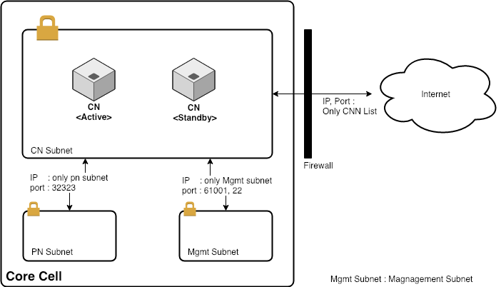

# 네트워크 구성 

코어 셀은 다음으로 구성 될 수 있습니다:

* 여러 서브넷(권장)
* 단일 서브넷

## 여러 서브넷이 있는 코어 셀 

DB + AppServer 및 프록시 웹 서버와 같은 일반 웹 서비스에 사용되는 2-레이어 서브넷을 사용하는 것이 좋습니다. 이 서브넷 디자인은 보안에 더 많은 이점을 제공합니다.

모든 서버를 다른 레이어로 관리하려면 모니터링 서버도 필요하므로, 다음 장에서는 3-레이어 서브넷으로 코어 셀을 설정하는 방법에 대해 설명합니다.

3-레이어 서브넷은 다음으로 구성됩니다:

* CN 서브넷
* PN 서브넷
* 관리(Mgmt) 서브넷

### CN 서브넷 

CN 서브넷은 코어 셀의 CN 서버로 구성됩니다. 코어 셀에서 작동하는 CN은 하나이지만, 높은 가용성을 위해 여분의 CN을 준비해야 합니다. CCN (Core Cell Network) 내의 모든 CN의 IP/포트는 코어 셀 외부에서 다른 CN에 연결을 시도하기 때문에 서로에게 열려 있어야 합니다. (This connection information can be received from Baobab operators.) The internal communication with other subnets in the Core Cell requires to open default port (32323: default Klaytn P2P port number) in order to connect to PNs of the PN Subnet. 또한 모니터링 서버를 위한 CN 모니터링 포트 (61001) 및 관리 목적을 위한 SSH 포트 (22)와 같은 다른 포트들을 열어야 합니다. 멀티채널 기능을 사용하는 경우 다른 포트 (32324: 기본 멀티채널 포트)도 열어야 합니다.

| 오리진 서브넷 | 타겟 서브넷  | Ingress                      | Egress |
|:------- |:------- |:---------------------------- |:------ |
| CN 서브넷  | PN 서브넷  | P2P : 32323 (멀티채널의 경우 32324) | 전부     |
| CN 서브넷  | 관리 서브넷  | SSH : 22, 모니터링 : 61001       | 전부     |
| CN 서브넷  | 공개(인터넷) | 각 CN의 IP 및 P2P 포트            | 전부     |

### PN 서브넷 

PN 서브넷은 외부 EN에 연결하기 위한 서비스를 제공하기 위해 PN 서버로 구성됩니다.

PN 서브넷은 다음 노드에 연결되어 있습니다:

* 코어 셀의 CN
* 다른 코어 셀의 일부 PN
* 코어 셀 관리 서버(Mgmt, 모니터링)
* EN 노드

| 오리진 서브넷 | 타겟 서브넷  | Ingress                      | Egress |
|:------- |:------- |:---------------------------- |:------ |
| PN 서브넷  | CN 서브넷  | P2P : 32323 (멀티채널의 경우 32324) | 전부     |
| PN 서브넷  | 관리 서브넷  | SSH : 22, 모니터링 : 61001       | 전부     |
| PN 서브넷  | 공개(인터넷) | P2P: 32323                   | 전부     |

### 관리 서브넷 

관리 서브넷은 운영자가 ssh를 통해 코어 셀 노드에 입력 할 수 있도록 하는 게이트웨이 서브넷입니다. 코어 셀 노드를 관리하기 위한 도구가 설치된 모니터링 서버 및 관리 서버와 연결하려면 VPN 서버가 필요할 수 있습니다.

| 오리진 서브넷 | 타겟 서브넷  | Ingress                         | Egress |
|:------- |:------- |:------------------------------- |:------ |
| 관리 서브넷  | CN 서브넷  | 전부                              | 전부     |
| 관리 서브넷  | PN 서브넷  | 전부                              | 전부     |
| 관리 서브넷  | 공개(인터넷) | VPN (tcp): 443, VPN (udp): 1194 | 전부     |

## 단일 서브넷을 가진 코어 셀 

코어 셀의 단일 서브넷은 개발/테스트 목적으로 또는 여러 서브넷을 생성하기 어려운 상황에서 구축되어집니다.

모든 노드는 단일 CC 서브넷에서 설정됩니다. CN이 P2P 포트(멀티채널 옵션의 경우 32323, 32324)를 사용하여 CNN 내의 다른 CN에 연결하려면 방화벽 설정이 필요합니다. PN의 P2P 포트는 엔드포인트 노드 네트워크(ENN)의 EN 및 코어 셀 네트워크(CNN)의 PN에 연결하기 위해 열립니다. 또한 선택적인 VPN 및 모니터링 서버를 원격으로 관리해야합니다.

