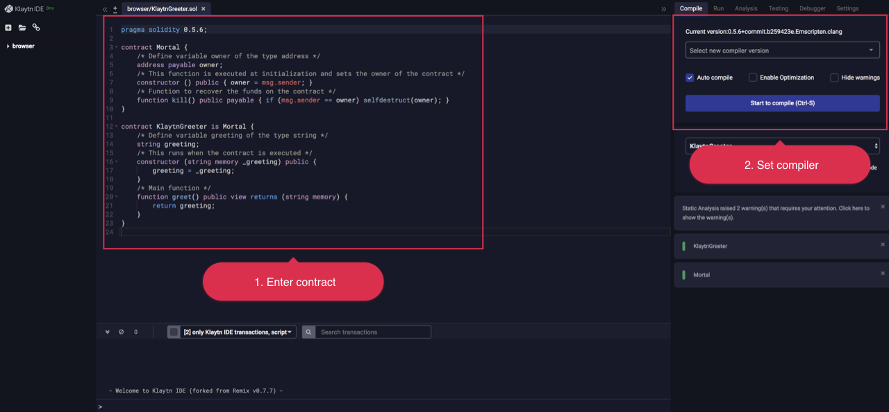
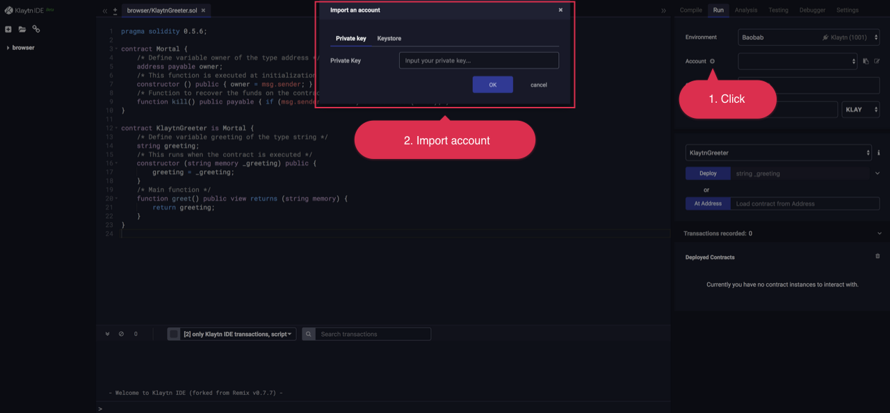
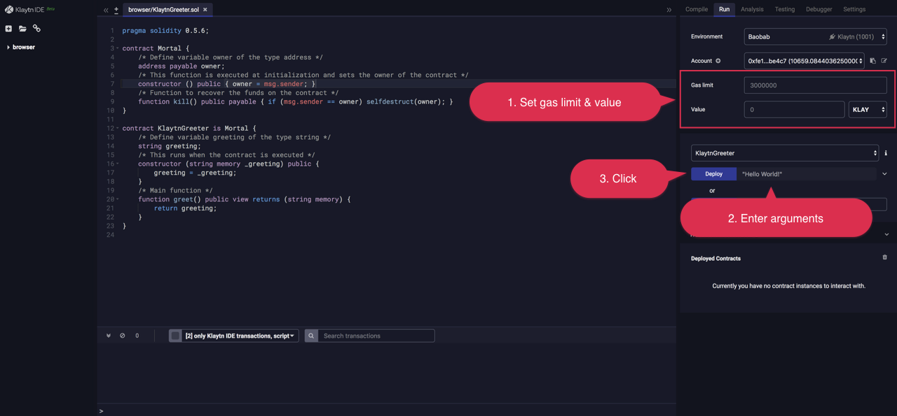
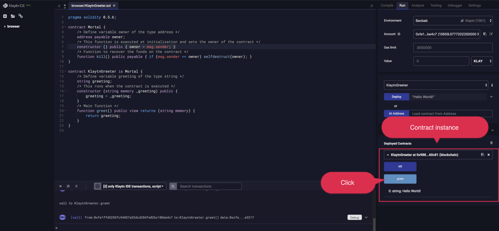

# 배포 가이드 <a id="deploy-guide"></a>

Klaytn에 스마트 컨트랙트를 배포하는 방법에는 여러 가지가 있습니다. 이 문서는 다양한 도구를 사용하여 샘플 컨트랙트를 배포하기 위한 단계별 가이드를 제공합니다. 트랜잭션 수수료를 지불하기에 충분한 KLAY가 있는 Klaytn 계정이 있다고 가정합니다. 계정을 만들려면 [Klaytn Wallet](../toolkit/klaytn-wallet.md)을 참조하세요.

## Klaytn IDE <a id="klaytn-ide"></a>

인터넷 브라우저를 열고 <0>https://ide.klaytn.com</0>으로 이동하세요.


- 새 파일을 추가하세요.


- 다음 코드(또는 배포하고자 하는 아무 코드)를 복사해 붙여넣습니다.

```
pragma solidity 0.5.6;
contract Mortal {
    /* 주소 타입의 소유자(owner) 변수 정의 */
    address payable owner;
    /* 이 함수는 초기화 시점에 실행되어 컨트랙트 소유자를 설정합니다 */
    constructor () public { owner = msg.sender; }
    /* 컨트랙트에서 자금을 회수하는 함수 */
    function kill() public payable { if (msg.sender == owner) selfdestruct(owner); }
}

contract KlaytnGreeter is Mortal {
    /* 문자열 타입의 변수 greeting 정의 */
    string greeting;
    /* 이 함수는 컨트랙트가 실행될 때 작동합니다 */
    constructor (string memory _greeting) public {
        greeting = _greeting;
    }
    /* 주(Main) 함수 */
    function greet() public view returns (string memory) {
        return greeting;
    }
}
```
- 컴파일러 버전을 설정하세요. 현재 0.4.24와 0.5.6 중에서 선택할 수 있습니다. (기본값은 0.5.6입니다.)




- 실행(Run) 탭을 클릭하세요. `환경(Environment)` 드롭다운에서 컨트랙트를 배포할 대상 네트워크를 선택할 수 있습니다. (Baobab은 테스트 네트워크이고 Cypress는 메인 네트워크입니다.)


- 네트워크를 선택한 후, `계정(Account)` 옆의 더하기 버튼을 클릭하여 계정을 가져옵니다. 네트워크에 컨트랙트를 배포하기에 충분한 `KLAY`를 가진 계정을 불러와야 합니다.



- 보낼 가스 한도 및 값을 설정하세요.
  - 보다 복잡한 컨트랙트를 배포하는 경우 가스 한도를 더 높게 설정해야 할 수 있습니다. 이 예시에서는 그대로 두어도 됩니다.
  - 배포 시 컨트랙트에 `KLAY`를 보내고 싶지 않다면 `값(Value)`을 0으로 설정하세요.
- "Hello World!"를 생성자 함수의 인자로 입력하고 `배포(Deploy)` 버튼을 클릭하세요. 모든 것이 성공적으로 진행되었다면, 배포된 컨트랙트의 인스턴스가 아래에 표시됩니다.



- 함수 버튼을 클릭하여 컨트랙트와 상호작용할 수 있습니다. 진한 파란색 버튼은 블록체인의 상태를 변경하고 가스를 소비하는 `전송(send)` 함수입니다. 하늘색 버튼은 상태를 변경하지 않고 트랜잭션 수수료를 요구하지 않는 `호출(call)` 함수입니다.



자세한 내용은 이 [링크](../toolkit/klaytn-ide.md)를 참조하세요.

## Truffle  <a id="truffle"></a>

트러플은 스마트 컨트랙트 배포 및 실행에 가장 널리 사용되는 프레임워크입니다.

- 다음 명령을 통해 설치하세요.

```
$ sudo npm install -g truffle
```

- 프로젝트 디렉토리를 설정하고, `truffle-hdwallet-provider-klaytn`를 설치하세요.

```
$ mkdir hello-klaytn
$ cd hello-klaytn
$ truffle init
$ npm install truffle-hdwallet-provider-klaytn
```

- `/contracts` 디렉토리 하에 `KlaytnGreeter.sol`를 생성하고 다음 코드를 복사합니다.

```
pragma solidity 0.5.6;
contract Mortal {
    /* 주소 타입의 소유자(owner) 변수 정의 */
    address payable owner;
    /* 이 함수는 초기화 시점에 실행되어 컨트랙트 소유자를 설정합니다 */
    constructor () public { owner = msg.sender; }
    /* 컨트랙트에서 자금을 회수하는 함수 */
    function kill() public payable { if (msg.sender == owner) selfdestruct(owner); }
}

contract KlaytnGreeter is Mortal {
    /* 문자열 타입의 변수 greeting 정의 */
    string greeting;
    /* 이 함수는 컨트랙트가 실행될 때 작동합니다 */
    constructor (string memory _greeting) public {
        greeting = _greeting;
    }
    /* 주(Main) 함수 */
    function greet() public view returns (string memory) {
        return greeting;
    }
}
```

- `/migrations/1_initial_migration.js`를 다음과 같이 수정합니다.

```
const Migrations = artifacts.require("./Migrations.sol");
const KlaytnGreeter = artifacts.require("./KlaytnGreeter.sol");
module.exports = function(deployer) {
  deployer.deploy(Migrations);
  deployer.deploy(KlaytnGreeter, 'Hello, Klaytn');
};
```

- 아래와 같이 `truffle-config.js`를 설정하세요. 컨트랙트를 배포할 충분한 `KLAY`를 가진 계정의 개인키를 입력하세요.

```
const HDWalletProvider = require("truffle-hdwallet-provider-klaytn");

const privateKey = "0x3de..." // Enter your private key;

module.exports = {
  networks: {
    development: {
      host: "localhost",
      port: 8545,
      network_id: "*" // Match any network id
    },
    testnet: {
      provider: () => new HDWalletProvider(privateKey, "https://your.baobab.en.url:8651"),
      network_id: '1001', //Klaytn baobab testnet's network id
      gas: '8500000',
      gasPrice: null
    },
    mainnet: {
      provider: () => new HDWalletProvider(privateKey, "https://your.cypress.en.url:8651"),
      network_id: '8217', //Klaytn mainnet's network id
      gas: '8500000',
      gasPrice: null
    }
  },
  compilers: {
    solc: {
      version: "0.5.6"
    }
  }
};
```
*참고*: 이 예제는 상업용으로 권장되지 않습니다. 개인키를 다룰 때 많은 주의를 기울이세요.

- Klaytn 테스트넷에 배포.

```
$ truffle deploy --network testnet
```

- Klaytn 메인넷에 배포.

```
$ truffle deploy --network mainnet
```

자세한 내용은 이 [링크](../toolkit/truffle.md)를 참조하세요.

## VVISP <a id="vvisp"></a>
vvisp은 스마트 컨트랙트 개발을 위해 HEACHI LABS에서 제공하는 사용하기 쉬운 cli 도구/프레임워크입니다. 단일 명령만으로 환경을 쉽게 설정하고, Klaytn 스마트 컨트랙트를 배포 및 실행할 수 있습니다. 자세한 내용을 위해 다음 링크를 참조하세요.
- https://henesis.gitbook.io/vvisp/deploying-smart-contracts

## solc & caver-js <a id="solc-caver-js"></a>

컨트랙트를 배포하는 또 다른 방법은 solc로 컨트랙트를 수동으로 컴파일하고 caver-js로 컨트랙트를 배포하는 것입니다.

- `KlaytnGreeter.sol`를 생성하고 다음 코드를 작성하세요.

```
pragma solidity 0.5.6;
contract Mortal {
    /* 주소 타입의 소유자(owner) 변수 정의 */
    address payable owner;
    /* 이 함수는 초기화 시점에 실행되어 컨트랙트 소유자를 설정합니다 */
    constructor () public { owner = msg.sender; }
    /* 컨트랙트에서 자금을 회수하는 함수 */
    function kill() public payable { if (msg.sender == owner) selfdestruct(owner); }
}

contract KlaytnGreeter is Mortal {
    /* 문자열 타입의 변수 greeting 정의 */
    string greeting;
    /* 이 함수는 컨트랙트가 실행될 때 작동합니다 */
    constructor (string memory _greeting) public {
        greeting = _greeting;
    }
    /* 주(Main) 함수 */
    function greet() public view returns (string memory) {
        return greeting;
    }
}
```

- solc 0.5.6을 설치하세요.

```
$ sudo npm install -g solc@0.5.6
```

- 컨트랙트를 컴파일하세요.

```
$ solcjs KlaytnGreeter.sol --bin
```

- caver-js를 설치하세요.

```
$ npm install caver-js.
```

- 같은 디렉토리에 다음 코드의 `deploy.js`를 생성하세요.

```
const Caver = require("caver-js");
const caver = new Caver("https://your.en.url:8651")

const walletInstance = caver.klay.accounts.privateKeyToAccount(
  '0x3de0c9...' // enter your private key to deploy contract with
);
caver.klay.accounts.wallet.add(walletInstance);

const fs = require('fs')
const bytecode = fs.readFileSync('./KlaytnGreeter_sol_KlaytnGreeter.bin') // compiled output

const constructorType = ['string']  // enter appropriate constructor type
const constructorValue = ['Hello, Klaytn!']

const params = caver.klay.abi.encodeParameters(constructorType, constructorValue);

caver.klay.sendTransaction({
  from: caver.klay.accounts.wallet[0].address,
  gas: "50000000",
  data: bytecode.toString() + params.substring(2, params.length)
})
.once("receipt", receipt => {
  console.log(receipt)
})
.once("error", error => {
  console.log(error);
})
```
*참고*: 이 예제는 상업용으로 권장되지 않습니다. 개인키를 다룰 때 많은 주의를 기울이세요.

- node 환경을 사용해 컨트랙트를 배포하세요.

```
$ node deploy.js
```

