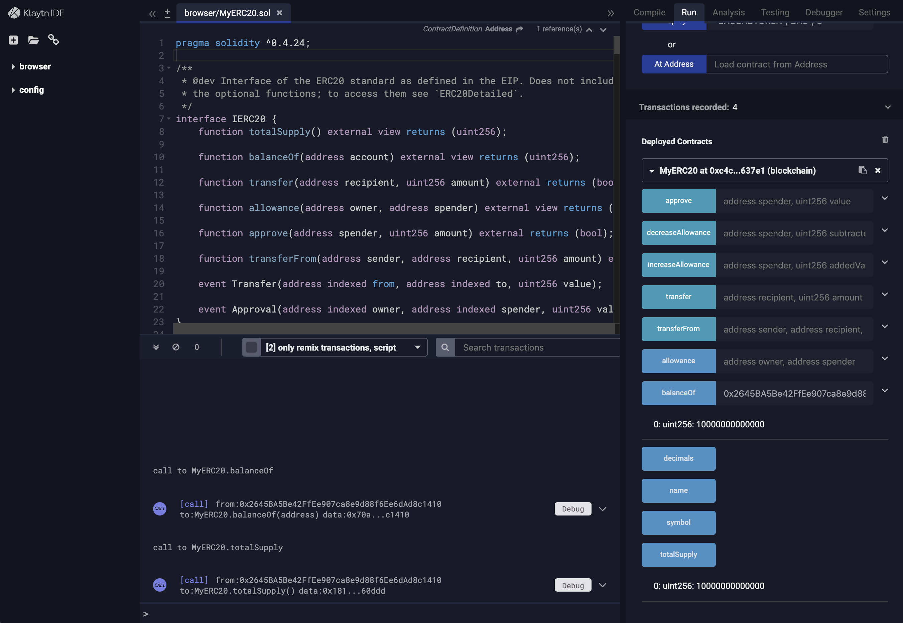

# 2. 스마트 컨트랙트 배포 <a id="2-deploying-smart-contract"></a>

Klaytn IDE 또는 트러플을 사용해 `MyERC20` 스마트 컨트랙트를 배포할 수 있습니다.

## 2.1 Klaytn IDE를 사용하여 스마트 컨트랙트 배포 <a id="2-1-deploying-smart-contract-using-klaytn-ide"></a>

* Klaytn IDE 웹사이트를 방문하여 `MyERC20` 컨트랙트를 생성하세요. 전체 소스 코드는 [ERC-20 스마트 컨트랙트 작성](1-erc20.md)에서 가져왔습니다.
* 컨트랙트를 배포하는 데 사용할 계정을 준비하세요.
  * If you do not have an account yet, create one at [https://baobab.wallet.klaytn.foundation/create](https://baobab.wallet.klaytn.foundation/create)
  * Get some test KLAY from the faucet - [https://baobab.wallet.klaytn.foundation/faucet](https://baobab.wallet.klaytn.foundation/faucet)
* `BAOBABTOKEN`의 배포 파라미터, `BAO` 및 `8`로 `MyERC20.sol`를 배포해봅시다.


배포 후 컨트랙트를 배포하는 데 사용한 계정으로 `balnaceOf`를 호출할 수 있습니다. 다음과 같이 `10000000000000` 토큰을 사용할 수 있음을 확인할 수 있습니다. 위에서 컨트랙트를 배포할 때 `decimal`을 `8`로 주었기 때문에, 생성자에서 `100000` 토큰을 발행했으며 한 토큰은 `10^8`의 값을 가집니다. `totalSupply` 메소드는 발행된 토큰의 총 공급량을 반환하며 이는 또한 `10000000000000`이어야 합니다.



이제 `MyERC20`가 활성화되었습니다!

## 2.2 truffle을 사용하여 스마트 컨트랙트 배포 <a id="2-2-deploying-smart-contract-using-truffle"></a>

환경에 [node.js](https://nodejs.org/)를 설치해야 합니다. 다양한 환경에서 패키지 매니저를 사용해 node.js를 설치하기 위해 [Installing Node.js via package manager](https://nodejs.org/en/download/package-manager/)를 살펴보시길 바랍니다.

```text
$ mkdir klaytn
$ cd klaytn
$ npm init # initialize npm at the erc20token directory
$ npm install truffle@4.1.15
$ npm install caver-js@latest # installing caver-js
$ ln -s node_modules/truffle/build/cli.bundled.js truffle
$ export PATH=`pwd`:$PATH
```

이제 스마트 컨트랙트를 배포하는 데 필요한 truffle 및 caver-js를 설치했습니다.

`truffle`과 스마트 컨트랙트 `MyERC20.sol`을 준비합시다.

```text
$ mkdir myerc20
$ cd myerc20
$ truffle init
```

이제 다음과 같은 디렉토리 구조를 가질 것입니다.

```text
.
├── contracts
│   ├── Migrations.sol
├── migrations
│   └── 1_initial_migration.js
└── truffle-config.js
```

이제 `MyERC20.sol`를 작성하고 `contracts` 디렉토리에 배치하세요.

또한 `BAOBABTOKEN`의 초기 파라미터, `BAO` 및 `8`로 `MyERC20`를 배포하기 위한 아래의 `1_initial_migration.js`도 편집하세요. 토큰 이름은 `BAOBABTOKEN`으로 설정되었으며 토큰 심볼은 `BAO`입니다. 토큰의 소수점 값은 `10^8`입니다. 예를 들어 `BAOBABTOKEN`의 `totalSupply`를 요청할 때, `10^5`가 아닌, `10^13`를 반환함에 주의하세요. 왜냐하면 솔리디티는 부동 소수점을 지원하지 않기 때문에 토큰 수는 항상 작은 작은 액면가인 자연수로 표시됩니다.

```javascript
const Migrations = artifacts.require("./Migrations.sol");
const MyERC20 = artifacts.require("./MyERC20.sol");
module.exports = function(deployer) {
  deployer.deploy(Migrations);
  deployer.deploy(MyERC20, 'BAOBABTOKEN', 'BAO', 8);
};
```

또한 Klaytn 네트워크에 스마트 컨트랙트를 배포하기 위해 아래와 같이 `truffle-config.js`를 편집해야 합니다. 이는 [트러플을 사용하여 스마트 컨트랙트 배포 ](../../../getting-started/quick-start/deploy-a-smart-contract.md#deploying-a-smart-contract-using-truffle)에 설명된 순서와 동일합니다.

```text
// truffle-config.js
module.exports = {
    networks: {
        baobab: {
            host: '127.0.0.1',
            port: 8551,
            from: '0xabcdabcdabcdabcdabcdabcdabcdabcdabcdabcd', // enter your account address
            network_id: '1001', // Baobab network id
            gas: 20000000, // transaction gas limit
            gasPrice: 750000000000, // gasPrice of Baobab is 750 ston
        },
    },
    compilers: {
      solc: {
        version: "0.5.12"    // Specify compiler's version to 0.5.12
      }
  }
};
```

이제 모두 준비되었으며 아래와 같이 `MyERC20.sol`를 배포할 수 있습니다.

```text
$ truffle deploy --network baobab --reset
Compiling ./contracts/MyERC20.sol...
Writing artifacts to ./build/contracts

Using network 'baobab'.

Running migration: 1_initial_migration.js
  Replacing Migrations...
  ... 0x5a947f076f4570dff8ff18b1ae3557e27dd69c92ce38a3c97fad8f5355914066
  Migrations: 0x0d737e9865e5fc4c1ff53744fd2c13c52a44b9bc
  Deploying MyERC20...
  ... 0x1571e80552dab1d67260e8914e06d9b16ccae16fb698c750f6a09aab12517bc1
  MyERC20: 0xc4c8257ED9B4eB6422fDe29B1eCe5Ce301e637e1
Saving successful migration to network...
  ... 0x5b984b3f79c425d80470a96d5badb857fc05e7f31d94423044ae3119c639aa77
Saving artifacts...
```

`MyERC20`를 배포하기 위한 트랜잭션 해시는 `0x1571e80552dab1d67260e8914e06d9b16ccae16fb698c750f6a09aab12517bc1`이며 `MyERC20`의 주소는 `0xc4c8257ED9B4eB6422fDe29B1eCe5Ce301e637e1`입니다.

이제 `MyERC20`가 활성화되었습니다!

