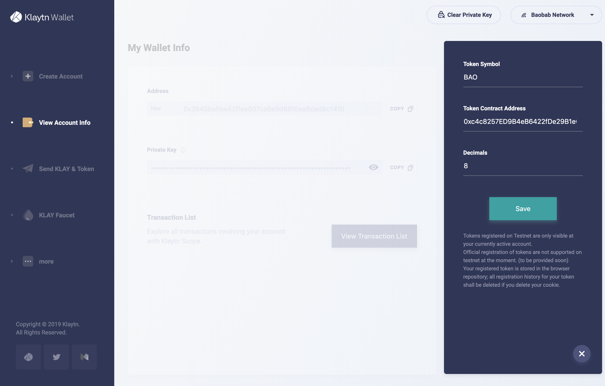
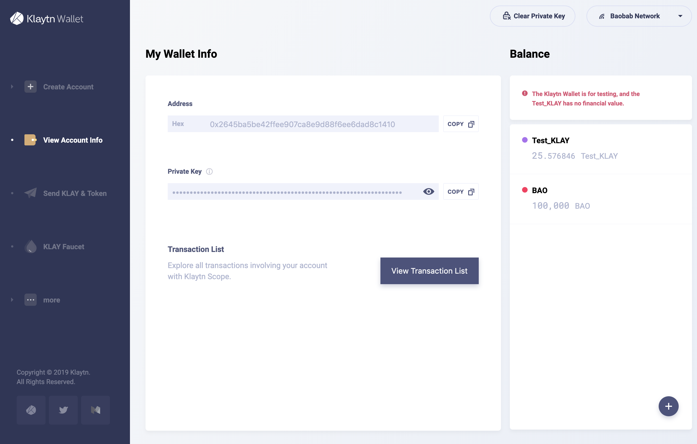

# 3. Klaytn Wallet에서 ERC-20 토큰과의 상호작용 

You can use [Baobab Klaytn Wallet](https://baobab.wallet.klaytn.foundation) to query your balance and transfer the ERC-20 compatible `BAOBABTOKEN` you just deployed.

아래 배포된 `MyERC20` 컨트랙트의 주소를 사용하여 지갑에 ERC-20 호환 토큰을 추가할 수 있습니다.

지갑 애플리케이션에 ERC-20 토큰을 추가한 후, 아래와 같이 KLAY의 잔액에 추가로 `BAOBABTOKEN`의 잔액이 보일 것입니다. 계정에 `100000` `BAO` 토큰이 있음을 알 수 있습니다.

