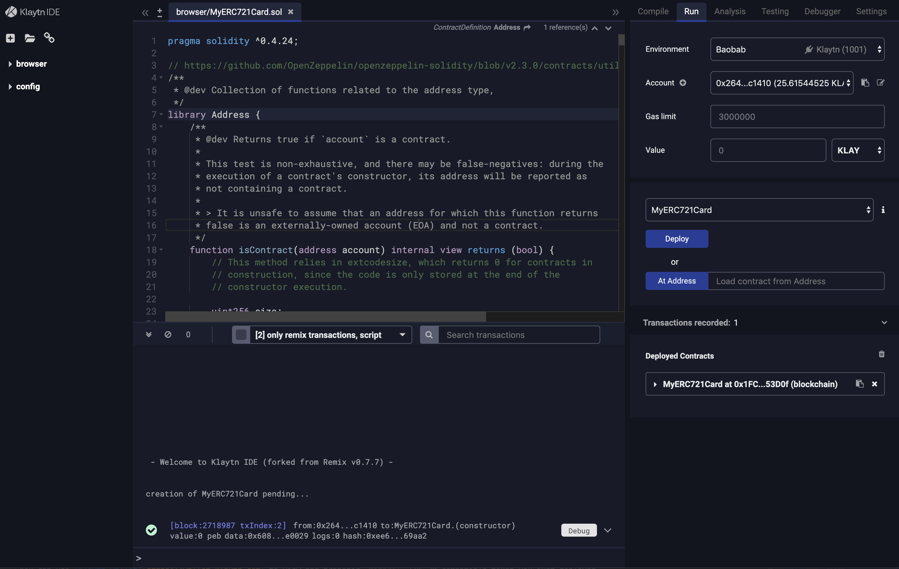
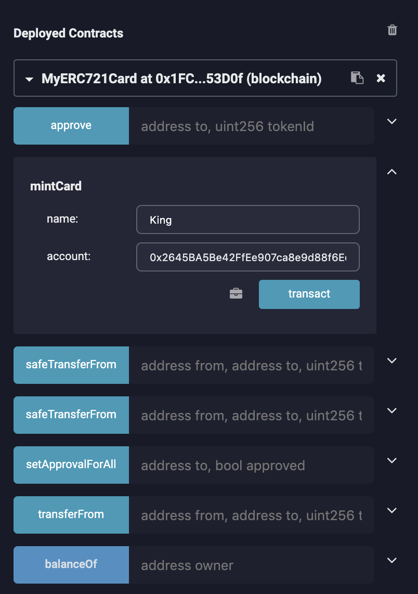
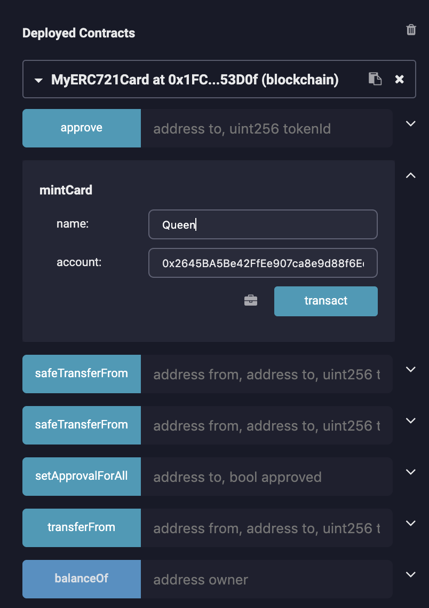
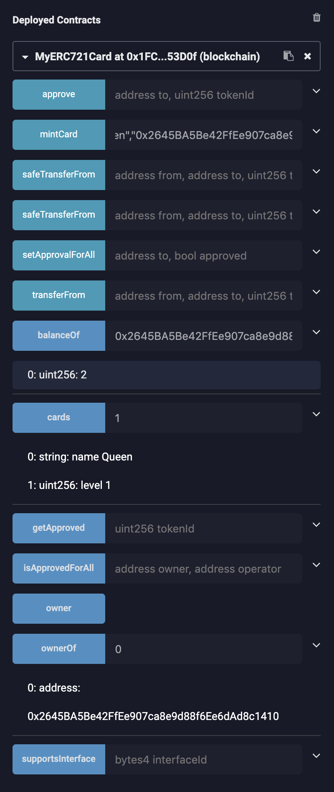

# 2. Deploying Smart Contract

You can use Remix Online IDE or use truffle to deploy above `MyERC721Card` smart contract.

## 2.1 Deploying smart contract using Remix Online IDE <a id="2-1-deploying-smart-contract-using-klaytn-ide"></a>

* Please visit [Klaytn Plugin for Remix](https://ide.klaytn.foundation) and create a `MyERC721Card` contract. The complete source code is given at [Writing ERC-721 Smart Contract](1-erc721.md).
* Create an account to deploy the contract with.
  * If you do not have an account yet, create one at [https://baobab.wallet.klaytn.foundation/create](https://baobab.wallet.klaytn.foundation/create) or [https://toolkit.klaytn.foundation/account/accountKeyLegacy](https://toolkit.klaytn.foundation/account/accountKeyLegacy).
  * Get some test KLAY from the faucet - [https://baobab.wallet.klaytn.foundation/faucet](https://baobab.wallet.klaytn.foundation/faucet)
* 아래와 같이 `MyERC721Card.sol`를 배포합시다.



이제 `MyERC721`가 활성화되었습니다! ERC-721을 호환하는 대체 불가능한 토큰인 카드를 발행하고 전송할 수 있습니다.

아래와 같이 두 카드, 즉 `King`과 `Queen` 카드를 `0x2645BA5Be42FfEe907ca8e9d88f6Ee6dAd8c1410` 계정에 대해 발행해봅시다.

 

이제 우리는 두 카드를 발행했고, 이들 `MyERC721Card` 대체 불가능한 토큰의 상태를 확인해봅시다.



* `balanceOf`는 계정 `0x2645BA5Be42FfEe907ca8e9d88f6Ee6dAd8c1410`가 두 카드를 가졌음을 보여줍니다.
* 파라미터 `1`인 `cards`는 토큰 ID가 `1`인 `MyERC721Card`가 레벨 1의 `Queen`임을 보여줍니다.
* 파라미터 `0`인 `ownerOf`는 토큰 ID가 `0`인 `MyERC721Card`의 소유자가 `0x2645BA5Be42FfEe907ca8e9d88f6Ee6dAd8c1410`임을 보여줍니다.

## 2.2 Deploying smart contract using truffle <a href="#2-2-deploying-smart-contract-using-truffle" id="2-2-deploying-smart-contract-using-truffle"></a>

You should have installed [node.js](https://nodejs.org/) in your environment. Please take a look at [Installing Node.js via package manager](https://nodejs.org/en/download/package-manager/) to install node.js using package manager in various environment.

```
$ mkdir klaytn
$ cd klaytn
$ npm init # initialize npm at the erc20token directory
$ npm install truffle@4.1.15
$ npm install caver-js@latest # installing caver-js
$ ln -s node_modules/truffle/build/cli.bundled.js truffle
$ export PATH=`pwd`:$PATH
```

이제 스마트 컨트랙트를 배포하는 데 필요한 truffle 및 caver-js를 설치했습니다.

`truffle`과 스마트 컨트랙트 `MyERC721Card.sol`을 준비합시다.

```
$ mkdir myerc721
$ cd myerc721
$ truffle init
```

Now you will have following directory structures.

```
.
├── contracts
│   ├── Migrations.sol
├── migrations
│   └── 1_initial_migration.js
└── truffle-config.js
```

`MyERC721Card.sol`를 작성하고 `contracts` 디렉토리에 위치시킨 후, 디렉토리 구조는 다음과 같을 것입니다.

Now you will have following directory structures.

```
.
├── contracts
│   ├── Migrations.sol
│   └── MyERC721Card.sol
├── migrations
│   └── 1_initial_migration.js
└── truffle-config.js
```

또한, `MyERC721Card` 컨트랙트를 배포하기 위해 아래와 같이 `1_initial_migration.js`를 편집하세요.

```javascript
const Migrations = artifacts.require("./Migrations.sol");
const MyERC721Card = artifacts.require("./MyERC721Card.sol");
module.exports = function(deployer) {
  deployer.deploy(Migrations);
  deployer.deploy(MyERC721Card)
};
```

또한 Klaytn 네트워크에 스마트 컨트랙트를 배포하기 위해 `truffle-config.js`를 구성해야 합니다. 이는 [트러플을 사용하여 스마트 컨트랙트 배포 ](../../../getting-started/quick-start/deploy-a-smart-contract.md#deploying-a-smart-contract-using-truffle)에 설명된 순서와 동일합니다.

```
// truffle-config.js
module.exports = {
    networks: {
        baobab: {
            host: '127.0.0.1',
            port: 8551,
            from: '0xabcdabcdabcdabcdabcdabcdabcdabcdabcdabcd', // enter your account address
            network_id: '1001', // Baobab network id
            gas: 20000000, // transaction gas limit
            gasPrice: 250000000000, // gasPrice of Baobab is 250 ston
        },
    },
    compilers: {
      solc: {
        version: "0.5.12"    // Specify compiler's version to 0.5.12
      }
  }
};
```

이제 모두 준비되었습니다. 다음 명령을 사용해 `MyERC721Card.sol`을 배포합시다.

```
$ truffle deploy --network baobab --reset
Compiling ./contracts/MyERC721Card.sol...
Writing artifacts to ./build/contracts

Using network 'baobab'.

Running migration: 1_initial_migration.js
  Replacing Migrations...
  ... 0x5a947f076f4570dff8ff18b1ae3557e27dd69c92ce38a3c97fad8f5355914066
  Migrations: 0x0d737e9865e5fc4c1ff53744fd2c13c52a44b9bc
  Deploying MyERC721Card...
  ... 0x1571e80552dab1d67260e8914e06d9b16ccae16fb698c750f6a09aab12517bc1
  MyERC721Card: 0xc3d282926871c505f334d0f2c85ad52758347831
Saving successful migration to network...
  ... 0x5b984b3f79c425d80470a96d5badb857fc05e7f31d94423044ae3119c639aa77
Saving artifacts...
```

`MyERC721Card`를 배포하기 위한 트랜잭션 해시는 `0x1571e80552dab1d67260e8914e06d9b16ccae16fb698c750f6a09aab12517bc1`이며 `MyERC721Card`의 주소는 `0xc3d282926871c505f334d0f2c85ad52758347831`입니다.
