# Klaytn IDE 

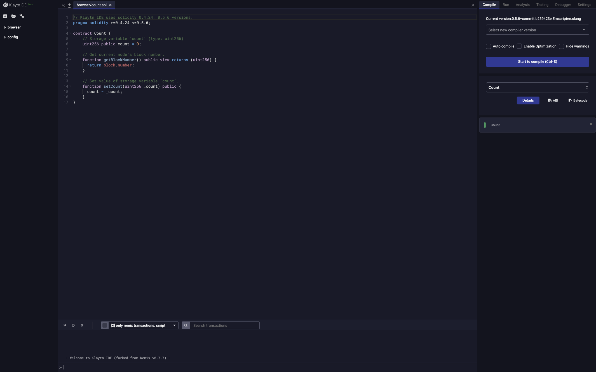

Klaytn IDE는 솔리디티 언어로 Klaytn 스마트 컨트랙트를 개발하도록 도와주는 브라우저 기반의 컴파일러 및 IDE입니다. 또한 Klaytn IDE는 스마트 컨트랙트의 테스트 및 배포를 지원합니다. Klaytn IDE는 Remix의 0.7.7 버전으로부터 파생되어 만들어졌습니다.

Klaytn IDE는 [https://ide.klaytn.com](https://ide.klaytn.com)에서 확인하실 수 있습니다. 본 문서는 Klaytn IDE의 개요로, 주요 기능과 사용법에 대해 설명하겠습니다. 더 자세한 내용은 [Remix docs](https://remix-ide.readthedocs.io/en/latest/)를 참고해주세요.

## Remix와 차이점

1. Klaytn 계정으로 로그인
2. 두 개의 솔리디티 버전\(v0.4.24, v0.5.6\) 지원
3. 플러그인, Gist 애드온, Swarm 미지원

## 개요 

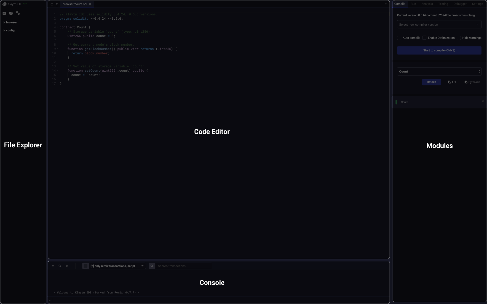

Klaytn IDE의 레이아웃은 다음과 같습니다. 화면은 파일 탐색기, 코드 편집기, 콘솔, 모듈 등 4개 부분으로 분할되어 있습니다.

## 1. 파일 탐색기 

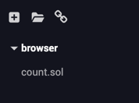

작업 공간 왼편의 파일 탐색기는 브라우저에 저장된 스마트 컨트랙트 파일의 목록을 나타냅니다. 브라우저 스토리지를 비우면 이전에 작성했던 스마트 컨트랙트 파일 모두 영구적으로 삭제됩니다. 파일 탐색기에서 파일을 추가하거나 삭제하고, 파일의 이름을 변경할 수 있습니다.

* 새 파일 생성
  * 새 파일 `Untitled1.sol`을 생성하려면 제목 표시줄에서  아이콘을 클릭하세요.
* 로컬 파일 추가
  * 로컬 파일 시스템에서 파일을 선택하여 브라우저 스토리지로 가져올 수 있습니다.  아이콘을 클릭하면 파일을 선택할 수 있습니다.
* 파일 이름 변경 및 삭제
  * 파일을 우클릭하면 파일의 이름을 변경하거나 파일을 삭제할 수 있는 메뉴가 나타납니다.

## 2. 코드 편집기 

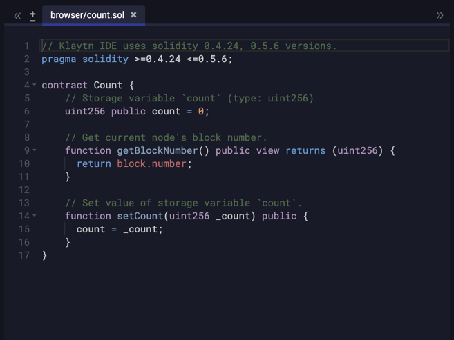

작업 공간의 중앙에서 파일을 편집할 수 있습니다.

### 파일 탭 

여러 파일을 열 수 있고, 코드 편집기는 현재 열린 파일을 탭에 나타냅니다. 파일 탐색기에 파일을 생성하거나 추가하면 해당 파일이 파일 탭에 나타납니다. 파일 탭에서  아이콘을 클릭하여 파일을 닫을 수 있습니다.

참고: \( 아이콘을 클릭하여\) 파일을 닫아도 해당 파일이 파일 탐색기에서 제거되지 않습니다.

### 솔리디티 예약어 자동 완성 

솔리디티에는 `bytes32`, `public`, `modifier`처럼 자주 사용되는 단어가 있습니다. 입력하려는 단어를 Klaytn IDE가 추천해주기 때문에 단어 자체를 직접 입력할 필요가 없습니다. 자동 완성 기능은 솔리디티의 예약어뿐만 아니라 사용자가 정의한 함수, 변수, 클래스에도 적용이 됩니다.

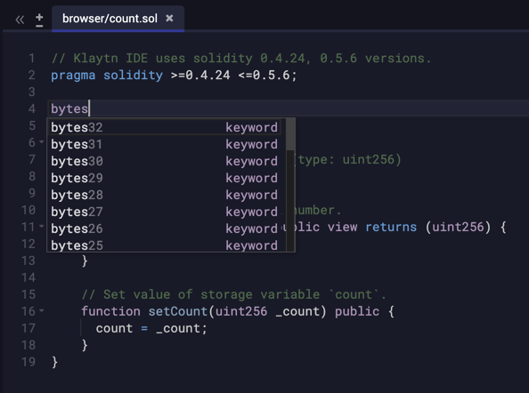

### 에러 감지 

컴파일 에러가 발생한 행은 해당 행의 번호 옆에 빨간색으로 표시됩니다.

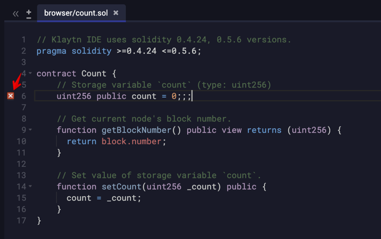

## 3. 모듈 

Klaytn IDE는 모듈에는 Compile, Run, Analysis, Testing, Debugger, Settings 등 6개 탭이 있습니다.

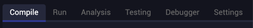

* Compile: 컴파일러 버전을 선택하고 여러 컴파일 옵션을 활성화/비활성화합니다. 컴파일된 프로젝트의 목록 또한 나타납니다.
* Run: 컨트랙트를 네트워크에 배포하고 컨트랙트 함수를 호출할 수 있습니다. 이 탭에는 네트워크, 계정, 가스 한도, 입력 인자 등 트랜잭션의 매개변수를 관리하는 옵션이 있습니다.
* Analysis: 선택한 체크리스트에 따라 정적 및 런타임 코드 분석을 실행할 수 있습니다.
* Testing: 유닛 테스트를 생성하고 실행합니다.
* Debugger: 트랜잭션을 디버깅합니다.
* Settings: 일반 설정과 도움말 & 지원 링크가 있습니다.

### Compile 

컴파일을 시작하려면 `Start to compile` 버튼을 클릭하세요. 각 파일을 저장하거나 다른 파일을 선택할 때마다 파일을 컴파일하려면 `Auto compile` 체크 박스를 체크하세요.

현재 솔리디티 v0.4.24과 v0.5.6 두 컴파일러 버전을 지원하고 있습니다. 따라서 솔리디티 코드의 맨 위는 `pragma solidity 0.4.24;` 또는 `pragma solidity 0.5.6`가 되어야 합니다. `"Compile"` 버튼 \(MacOS의 경우 Cmd+s, Windows의 경우 Ctrl+s\)을 필요할 때마다 수동으로 클릭할 수도 있고 자동 컴파일 기능을 활성화할 수도 있습니다.

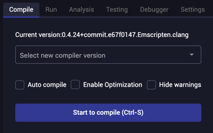

참고:

* 15초마다 코드가 자동으로 저장됩니다. 또한 파일을 컴파일하거나 파일 탭을 닫거나 Klaytn IDE를 종료할 때에도 자동으로 저장됩니다.
* 자동 컴파일 기능이 활성화되면 입력을 중지할 때 컴파일이 됩니다.

### Run 

#### Environment \(네트워크 선택 옵션\) 

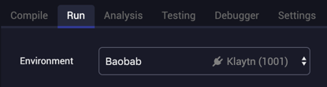

`"Environment"` 옵션을 클릭하면 하단으로 출력되는 네트워크 목록에서 하나를 선택하여 어떤 네트워크를 사용할 것인지 선택할 수 있습니다. Klaytn IDE는 기본적으로 다음 네트워크를 선택할 수 있습니다.

1. **Baobab 네트워크** \(Klaytn 테스트넷\)
2. **Cypress 네트워크** \(Klaytn 메인넷\)

그 외 사용자 정의 노드에 연결하려면 `"Caver provider"`를 선택하고 연결하려는 네트워크의 URL을 입력하세요. `HTTPS`가 아니라 `HTTP` 네트워크 프로토콜에 연결하려면 [http\://ide.klaytn.com](http://ide.klaytn.com)을 사용하세요.

> 컨트랙트를 배포하려면 트랜잭션 수수료를 지불하기 위한 KLAY가 필요합니다. `Baobab 네트워크` \(Klaytn 테스트넷\)의 경우 **테스트넷 KLAY**를 Faucet \[[https://baobab.wallet.klaytn.com/faucet](https://baobab.wallet.klaytn.com/faucet)\]에서 얻을 수 있습니다. **테스트넷 KLAY**를 받으면 해당 계정을 Klaytn IDE의 `"Account"`에서 선택하여 연동하세요.

#### Account \(계정 선택 옵션\) 

`계정 선택 옵션`을 통해 현재 계정을 다른 계정으로 변경할 수 있습니다.  버튼을 클릭하고, 개인키 또는 키스토어로 가져올 것인지 선택하여 계정을 가져올 수 있습니다.

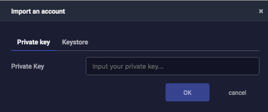

연동이 완료되면 수 초 내에 `Account`에 연동한 계정의 잔액이 나타납니다.

#### Value 

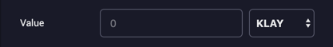

`Value (트랜잭션값 조절)` 옵션을 통해 다음에 생성된 트랜잭션의 값을 입력할 수 있습니다.

#### Gas Limit 조절 

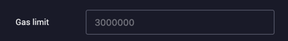

`Gas Limit` 옵션을 통해 스마트 컨트랙트 함수를 호출하는 데에 사용될 가스양의 최대한도를 설정할 수 있습니다.

#### Deploy 

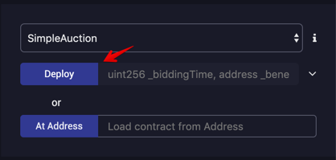

코드를 컴파일하면 하단에 컴파일된 컨트랙트의 목록이 나타납니다. 그중에 컨트랙트를 선택하고 `Deploy` 버튼을 클릭하여 배포할 수 있습니다.

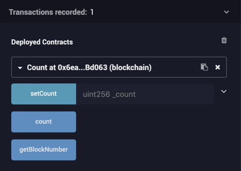

컨트랙트가 성공적으로 배포되면 컨트랙트의 주소와 해당 컨트랙트의 함수들이 나타납니다. 스마트 컨트랙트에는 블록체인에 데이터를 쓰는 함수와 블록체인으로부터 데이터를 읽어오는 함수 두 종류의 함수가 있습니다.

### Analysis 

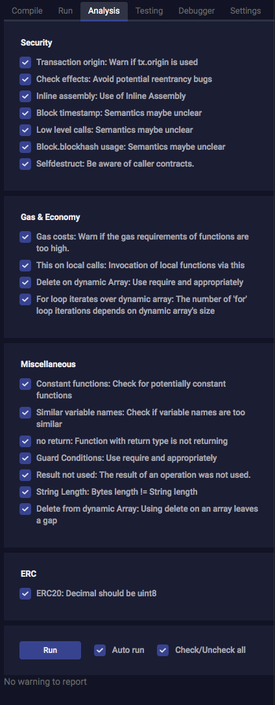

이 장에서는 마지막 컴파일 결과를 확인할 수 있습니다. 기본적으로 각 컴파일당 새로운 분석이 실행됩니다.

분석 탭에서는 컨트랙트 코드에 대한 자세한 정보를 확인할 수 있습니다. 이를 통해 코드 실수를 피하고 모범 사례를 시행할 수 있습니다.

자세한 안내는  [Remix docs &gt; Analysis ](https://remix-ide.readthedocs.io/en/latest/static_analysis.html?highlight=analysis)을 참고하세요.

### Testing 

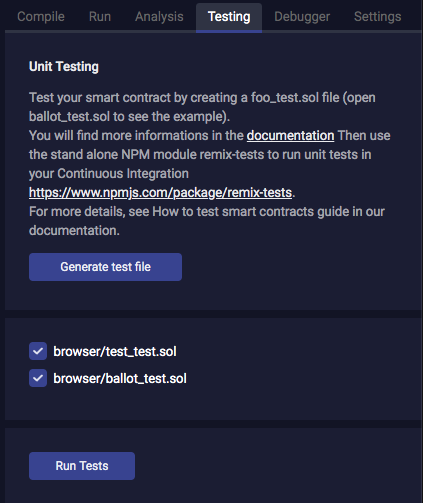

이 장에서는 새로운 솔리디티 테스트 파일을 현재 폴더에서 생성하고 테스트를 실행할 수 있습니다. 실행 결과는 아래에 나타납니다. 자세한 안내는 [Remix docs &gt; Unit Testing](https://remix-ide.readthedocs.io/en/latest/unittesting.html)을 참고하세요.

### Debugger 

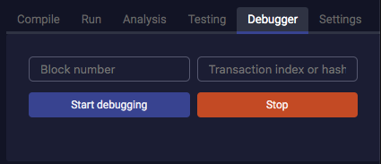

이 장에서는 트랜잭션을 디버깅할 수 있습니다. IDE에서 생성된 트랜잭션과 이미 채굴된 트랜잭션을 배포하는 데에 사용할 수 있습니다.

> 필요한 기능을 현재 환경에서 제공하는 경우에만 디버깅이 작동합니다. 디버깅하려면 EN 노드에서 **개인** API가 활성화되어야 합니다. `RPC_API` 옵션을 [EN 환경설정 파일](../node/endpoint-node/operation-guide/configuration.md)에서 참고해주세요.

자세한 안내는 [Remix docs &gt; Debugger](https://remix-ide.readthedocs.io/en/latest/debugger.html)를 참고하세요.

### Settings 

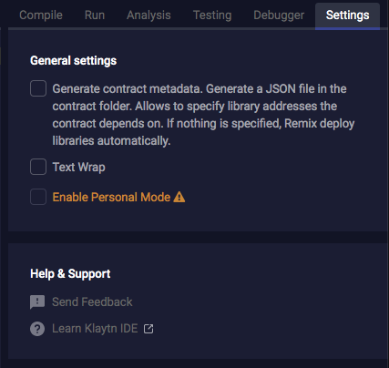

이 탭에는 일반 설정 및 지원 채널이 있습니다.

주요 설정:

* Text Wrap: 편집기의 텍스트 줄 바꿈 여부를 설정합니다.
* Enable Personal Mode : 프라이빗 네트워크에서 사용합니다.

## 4. 터미널 

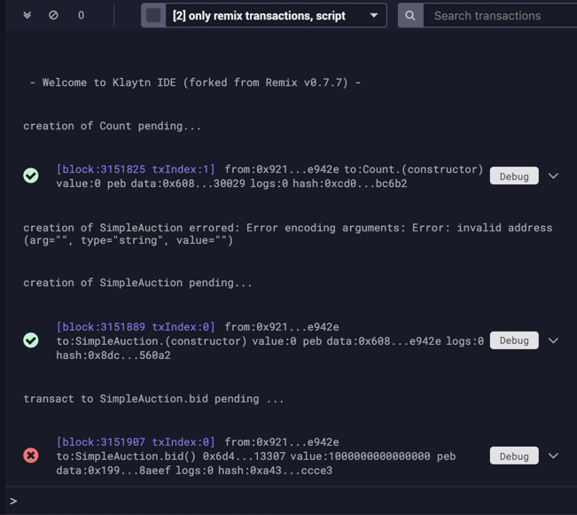

코드 편집기 하단의 터미널에 컴파일 결과, 컴파일 에러, 배포 결과, 트랜잭션 정보가 나타납니다.

트랜잭션 결과를 클릭하여 자세한 정보를 확인할 수 있습니다. 디버깅이 가능한 경우 Debug 탭에서 트랜잭션 디버깅을 할 수 있습니다.

## OpenZepplin으로 개발하기 

OpenZeppelin은 안전한 스마트 컨트랙트 개발을 위한 라이브러리입니다. OpenZeppelin은 ERC20과 ERC721과 같은 표준 구현체를 제공하여 이를 그대로 배포하거나 필요에 따라 확장할 수 있습니다. 그뿐만 아니라 맞춤형 컨트랙트와 더 복잡한 탈중앙화된 시스템을 구축할 수 있도록 솔리디티 컴포넌트를 제공합니다.

OpenZepplin 라이브러리는 remixd를 통해 로컬 호스트에 연결한 후 사용할 수 있습니다. 따라서 remixd의 설치가 필요합니다.

### Remixd 설치 

Remixd는 Remix IDE \( 브라우저 솔리디티\)에서 사용하기 위한 도구입니다. Remixd는 Remix IDE \(web application\)와 로컬 컴퓨터 간 웹소켓 연결을 하도록 합니다. 자세한 내용은 [remixd 문서](https://remix-ide.readthedocs.io/en/latest/remixd.html?highlight=remixd)를 참고해주세요.

`remixd`는 다음 명령어를 사용하여 전역적으로 설치할 수 있습니다. 설치 후 `remixd`를 입력하여 실행하세요. `-s` 옵션은 IDE가 주어진 폴더에 접근할 수 있도록 합니다. 해당 폴더에는 OpenZepplin을 설치하고 컨트랙트 소스 코드들을 넣을 것입니다.

\`\`\`bash $ remixd -s  --remix-ide [http://ide.klaytn.com](http://ide.klaytn.com)

예를 들어, `remixd -s ~/temp/openzepplin --remix-ide http://ide.klaytn.com`

터미널에서 다음과 같은 메세지를 확인할 수 있습니다.

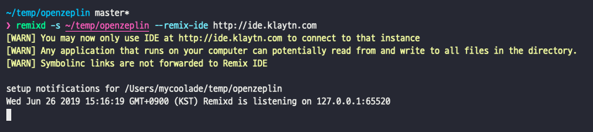

### OpenZepplin 설치 

공유 폴더로 이동하여 OpenZepplin을 설치하세요.

\`\`\`bash $ cd  $ npm install openzeppelin-solidity

### Remixd 연결 

아래와 같이 Remix 연결 버튼을 클릭하세요.

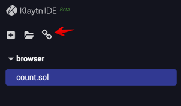

Connect 버튼을 클릭하세요.

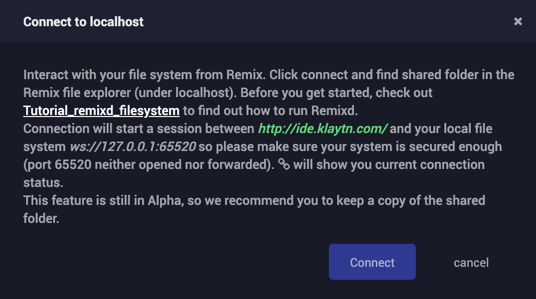

파일 탐색기에 localhost 디렉토리가 나타납니다.

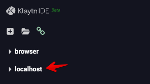

OpenZepplin에서 필요한 솔리디티 컨트랙트 파일을 가져오세요.

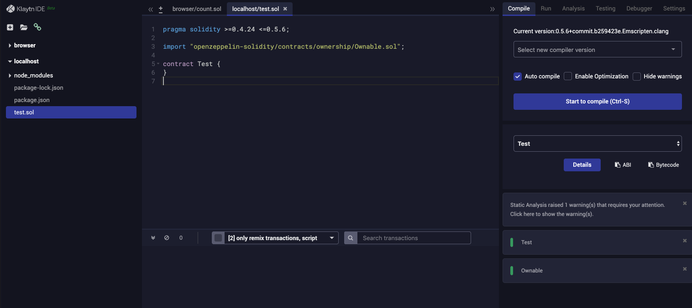

## 자세한 내용 보기

Klaytn IDE는 Remix v0.7.7을 기반으로 합니다. 많은 기능이 호환되고 있으므로 [official Remix documentation](https://remix-ide.readthedocs.io/en/latest/)을 참고해주세요.

## 의견 보내기

Klaytn IDE에 대한 의견 또는 제안은 [developer@klaytn.com](mailto:developer@klaytn.com)으로 이메일을 보내주세요!

