# Klaytn Wallet 

Klaytn Wallet is a browser-based account management tool for dApp (decentralized application) developers on Klaytn. Klaytn Wallet은 Klaytn 노드를 로컬로 실행하지 않고도 개발자가 웹 브라우저를 통해 새 계정을 만들거나 기존 계정의 정보를 직접 볼 수 있도록 합니다. Klaytn Wallet을 통해 사용자가 테스트 목적으로 KLAY 또는 Klaytn 토큰을 다른 계정으로 전송할 수 있습니다.

#### 보안 관련 중요 공지 

> **참고:** Klaytn Wallet은 개발과 테스트 목적으로만 사용해야 합니다. 저장 용도 또는 KLAY 및 Klaytn 토큰을 전송하는 등 Klaytn Wallet을 상업적 또는 개인적 용도로 사용하지 마세요. Klaytn Wallet은 상업 용도를 위한 보안 테스트를 거치지 않아 악의적인 공격에 취약할 수 있습니다. Klaytn Wallet은 사용자의 개인키를 브라우저의 로컬 스토리지에 저장하므로 브라우저의 보안 취약점을 악용한 공격에 취약할 수 있습니다.

* Cypress 메인넷의 Klaytn Wallet: [https://wallet.klaytn.com](https://wallet.klaytn.com)
* Klaytn Wallet for the Baobab testnet: [https://baobab.wallet.klaytn.foundation](https://baobab.wallet.klaytn.foundation)

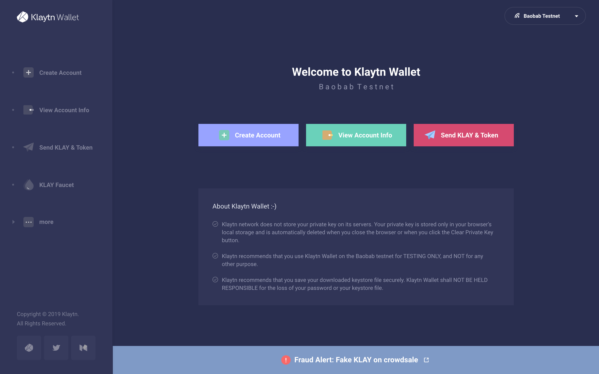

## Klaytn Wallet 기능 

Klaytn Wallet은 다음의 기능을 제공합니다.

* 계정 및 키 관리
  * 새 계정 생성
  * 개인키 또는 키스토어 파일을 사용하여 기존 계정 불러오기
  * 새 키스토어 파일 다운로드
* 자산 관리
  * 계정 잔액 확인
  * 지갑에 토큰 추가
  * KLAY 및 Klaytn 토큰 전송
* Baobab 테스트넷의 KLAY Faucet

## 새 계정 생성하기 

> Klaytn 계정이 이미 있다면 이 과정은 건너뛰고 [기존 계정 접속하기](#access-existing-account)로 이동하세요.

Klaytn Wallet을 사용하여 새로운 Klaytn 계정을 생성할 수 있습니다. 새 계정을 생성하려면 좌측 메뉴 모음에서 `Create Account` 버튼을 클릭하고 아래 단계를 따라주세요.

* 1단계: 새 계정의 키스토어 파일에 비밀번호를 설정하세요.
* 2단계: 로컬 스토리지에 키스토어 파일을 다운로드하세요.
* 3단계: 새 계정의 Klaytn Wallet 키를 저장하세요.

### 계속하기 전에 몇 가지 주의 사항이 있습니다.

* 절대로 '지갑 키' 또는 '개인키'를 누구와도 공유하지 마세요. '지갑 키' 또는 '개인키' 정보를 제공한다는 것은 계정에 접속할 수 있는 권한을 완전히 영구적으로 부여하는 것입니다.
* 이 정보를 인터넷에 연결된 장치에 보관하지 마세요. 해커가 로컬 스토리지에서 탈취할 수도 있습니다.
* 강력한 비밀번호를 설정하고 중요한 정보를 여러 위치에 나누어 저장하세요.
* '지갑 키' 또는 '개인키'를 분실하면 Klaytn은 복원할 수 없습니다. 키 정보를 잃지 않도록 최대한 주의하세요.

### 1단계: 키스토어 파일의 비밀번호 설정 

새 계정을 생성하는 첫 번째 단계로 키스토어 파일의 비밀번호를 설정해야 합니다. 키스토어 파일은 Klaytn 계정의 주소와 개인키를 포함한 계정 정보를 안전하게 담고 있는 JSON 파일입니다. 키스토어에 설정한 비밀번호가 키스토어 파일 내의 개인키를 보호하는 것이므로 Klaytn의 보안 기준을 만족할 수 있을 정도로 강력한 비밀번호로 설정해야 합니다.

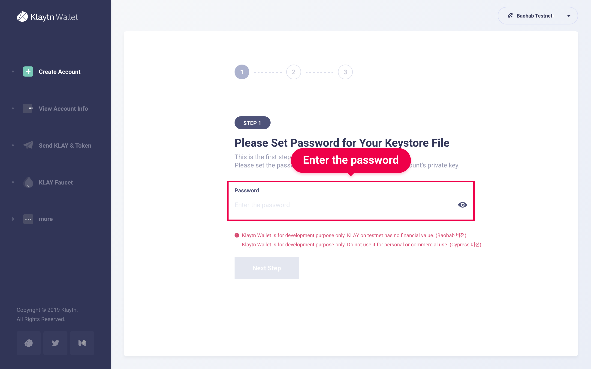

비밀번호 입력 양식을 클릭하면 상단에 툴팁이 나타나 입력한 비밀번호가 보안 요구 기준을 충족하는지 알려줍니다. 요구 기준에 맞추어 비밀번호를 입력했다면 `Next Step` 버튼이 활성화됩니다. !

### 2단계: 키스토어 파일 다운로드 

두 번째 단계에서는 설정한 비밀번호로 암호화된 키스토어 파일을 다운로드합니다. `Download & Next Step` 버튼을 클릭하여 키스토어 파일을 바로 다운로드하고 마지막 단계로 이동하세요. (다운로드한 키스토어 파일을 손실한 경우 `View Account Info` 메뉴에서 새로운 키스토어 파일을 다운로드할 수 있습니다.)

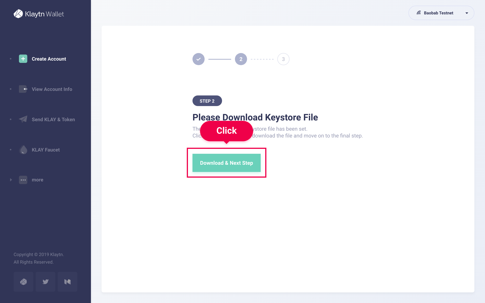

### 3단계: Klaytn 지갑 키 및 개인키 저장 

마지막 단계에서는 새로 생성한 지갑의 키와 개인키를 확인할 수 있습니다. 인터넷이 연결되지 않는 별도의 스토리지에 키를 저장하기를 권장합니다.

Klaytn 계정에 대한 자세한 내용은 Klaytn Docs의 [계정](../klaytn/design/accounts.md) 장을 참고해주세요.

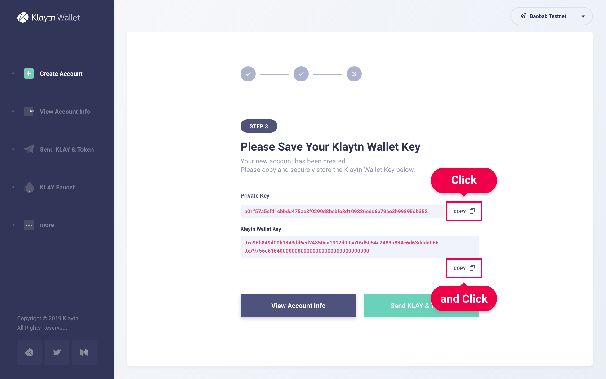

## 기존 계정 접속하기 

계정의 KLAY 또는 Klaytn 토큰의 잔액을 확인하거나 다른 계정으로 토큰을 전송하려면 계정에 접속해야 합니다. Klaytn Wallet은 계정에 접속하는 두 가지 방법을 제공합니다.

* **Klaytn 지갑 키 또는 개인키 사용** Klaytn 지갑 키는 계정과 관련된 16진수 110자의 문자열이지만, 개인키는 16진수 64자의 문자열입니다. ("0x" 접두사는 16진수를 나타내는 용으로, 문자 개수에 포함되지 않습니다.) 0x까지 센다면 Klaytn 지갑 키는 112자, 개인키는 66자일 것입니다. 개인키를 사용하는 것은 다른 모든 시도가 실패할 시 사용하는 최후의 접속 방법이어야 합니다. 계정에 접속하는 주된 방법이 되어서는 안 됩니다. 개인키는 계정에 대해 완전히 접속을 허용하기 때문에 가장 민감하게 다뤄줘야 하는 정보임을 명심하세요. 따라서 개인키를 안전하게 보관하고 비밀로 유지해야합니다.
* **키스토어 파일과 비밀번호** 키스토어 파일은 암호화된 개인키와 계정의 주소 정보가 저장된 JSON 파일입니다. 이 파일은 사용자가 설정한 비밀번호로 암호화되어 있습니다.

### Klaytn 지갑 키 또는 개인키를 사용하여 기존 계정 접속 

#### 1단계: 지갑 키 또는 개인키를 입력하세요. 

계정에 접속하려면 왼쪽 메뉴 모음에서 `View Account Info` 버튼을 클릭하여 화면의 `Private Key` 탭으로 이동하세요. 접속하려는 계정의 Klaytn 지갑 키 또는 개인키를 입력하세요.

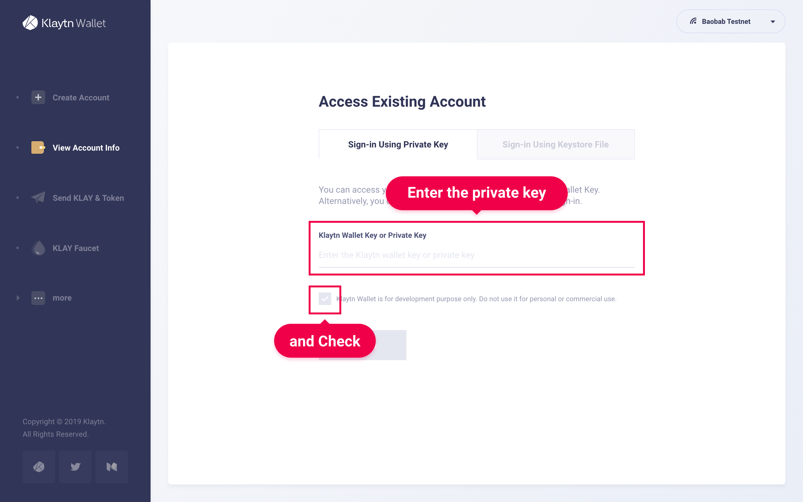

#### 2단계: 체크 박스를 체크하고 'Access' 버튼을 클릭하세요. 

`Access` 버튼을 클릭하여 계정 페이지로 이동하세요. 입력한 키 정보가 키 형식에 맞지 않는 경우 `Access` 버튼이 활성화되지 않습니다.

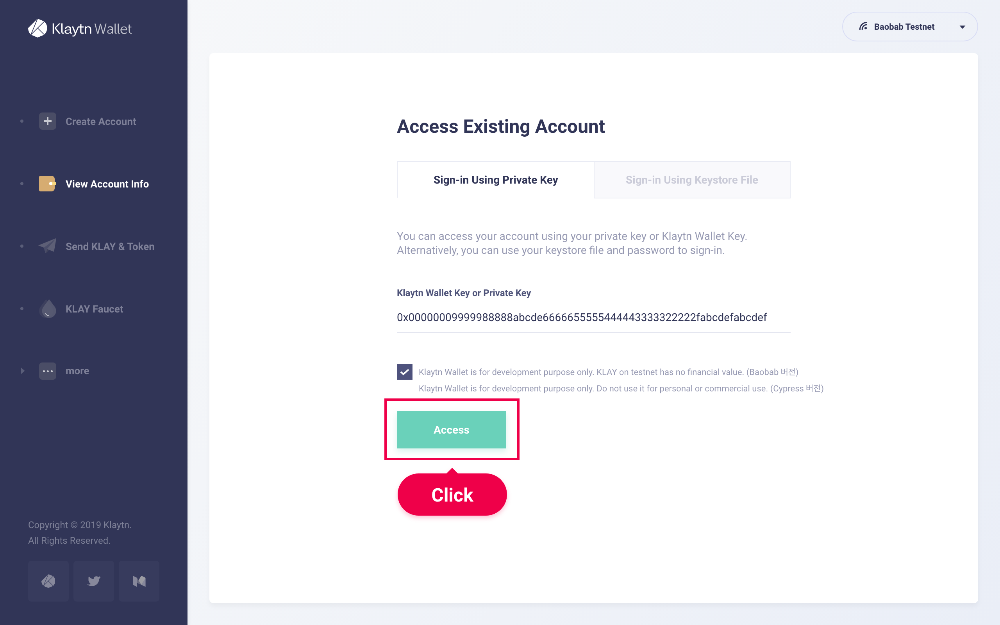

### 키스토어 파일과 비밀번호를 사용하여 기존 계정 접속 

#### 1단계: 키스토어 파일 탭으로 이동하세요. 

화면의 `Keystore File` 탭으로 이동하세요.

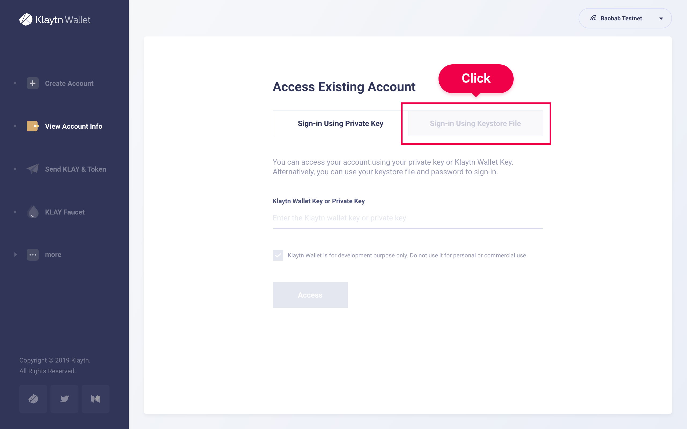

#### 2단계: 사용할 키스토어 파일을 선택하세요. 

`Upload` 버튼을 클릭하여 키스토어 파일을 찾아주세요.

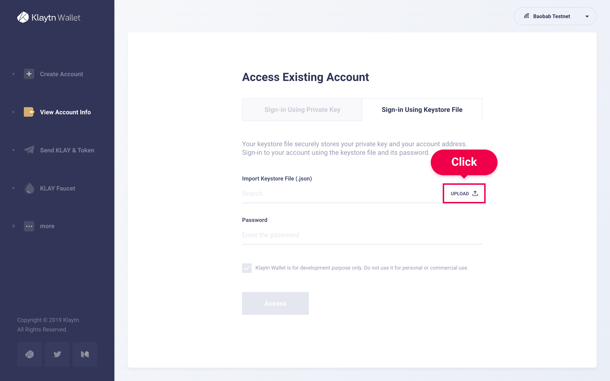

#### 3단계: 키스토어 파일의 비밀번호를 입력하세요. 

선택한 키스토어 파일의 비밀번호를 입력하고 `Access` 버튼을 클릭하여 계정 페이지로 이동하세요.

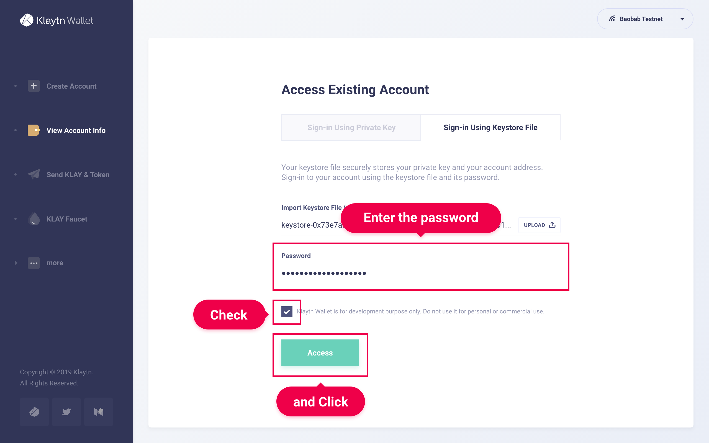

### View Account Info 

이 페이지를 통해 계정 주소, 개인키, Klaytn 지갑 키 정보를 확인할 수 있습니다. 페이지의 우측에서 KLAY와 Klaytn 토큰 잔액을 확인할 수 있습니다. 보안상의 이유로 계정의 잔액 확인이 필요할 때마다 계정 잠금 해제하는 것을 원치 않는 블록체인 애플리케이션 개발자의 경우 Klaytn Wallet을 사용하여 계정의 잔액을 확인하는 것이 좋습니다.

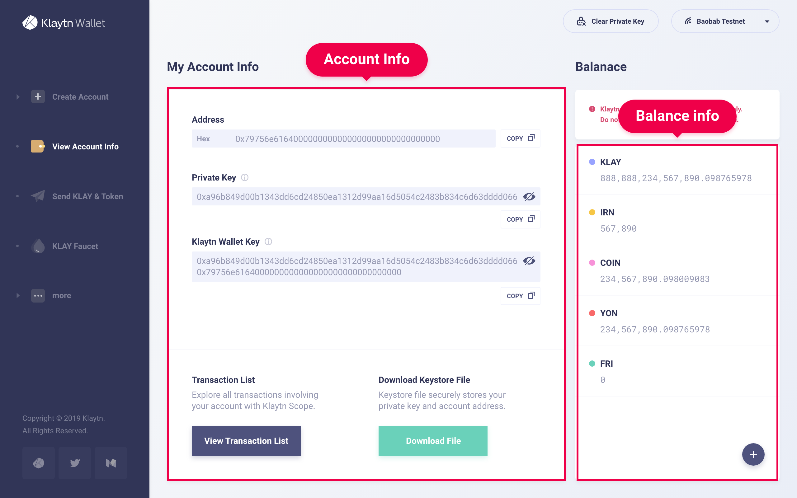

## Klaytn 토큰 추가하기 

Klaytn Wallet은 KLAY 및 Klaytn 토큰 등록을 지원하여 잔액을 확인할 수 있도록 합니다. Klaytn 토큰을 Klaytn Wallet에 등록하려면 아래 단계를 따라주세요.

### 1단계: 기존 계정 정보에 접속하세요. 

[기존 계정 접속하기](#access-existing-account)의 단계에 따라 계정 페이지로 이동하세요.

### 2단계: 잔액 확인 장에서 토큰 추가 버튼을 클릭하세요. 

`Balance` 장의 우측 하단에 있는 '+' 버튼을 클릭하세요.

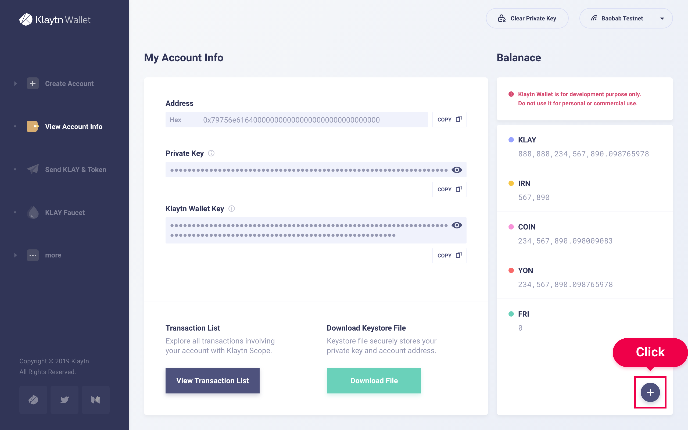

### 3단계: 토큰 정보를 입력하세요. 

`Token Symbol`, `Token Contract Address`, `Decimals`를 입력하세요. `Save` 버튼을 클릭한 후 계정 잔액 장에 추가한 토큰이 나타납니다.

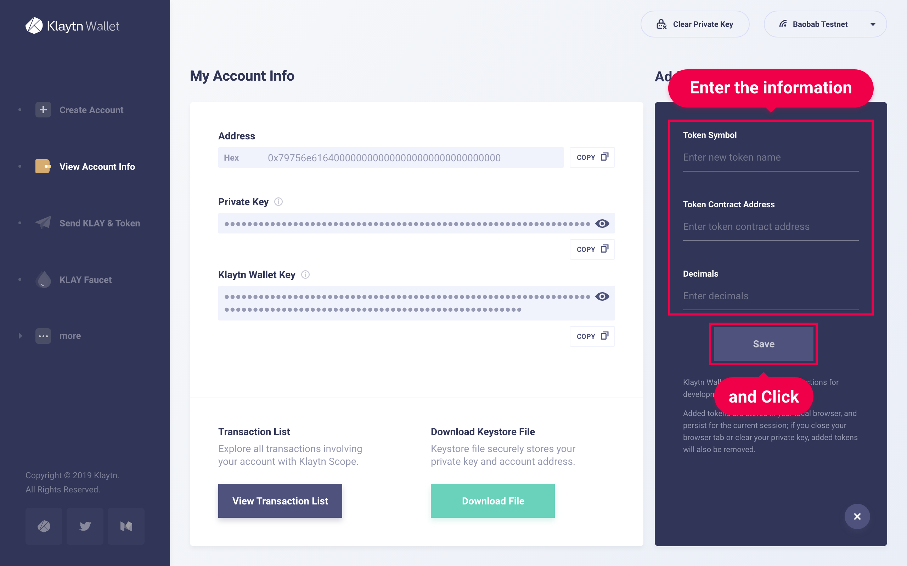

## KLAY 및 토큰 전송하기 

Klaytn Wallet을 사용하여 KLAY 또는 Klaytn 토큰을 다른 계정으로 보낼 수 있습니다. KLAY 또는 토큰을 보낼 때 해당 계정에 트랜잭션 수수료를 지불할 최소한의 KLAY가 있어야 합니다.

### 1단계: 'Send KLAY & Tokens' 메뉴로 이동하세요. 

좌측 메뉴 모음이나 메인 페이지에서 `Send KLAY & Token` 버튼을 클릭하세요.

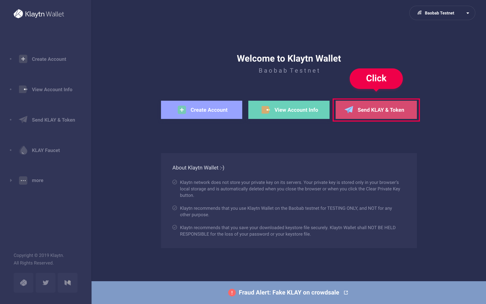

### 2단계: 계정에 접속하세요. 

아직 지갑에 계정을 불러오지 않은 경우 [기존 계정 접속하기](#access-existing-account)를 따라 완료해주세요.

### 3단계: 전송할 토큰을 선택하세요. 

`Step 1. Select Tokens` 부분에서 전송할 토큰을 선택하세요.

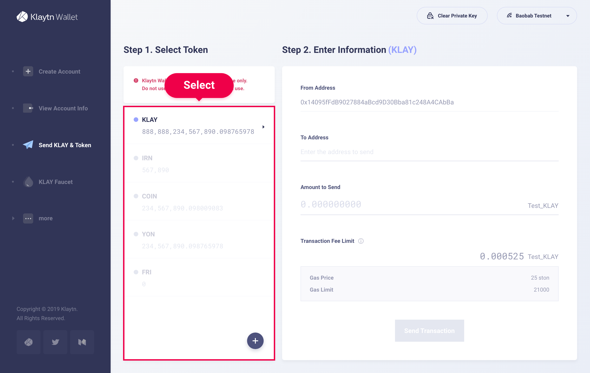

### 4단계: 토큰 전송 정보를 입력하세요. 

전송할 토큰을 선택한 후 `Step 2. Enter the information` 부분으로 이동하여 필요한 정보 (`To Address`, `Amount to Send`)를 입력하고 `Send Transaction` 버튼을 클릭하세요.

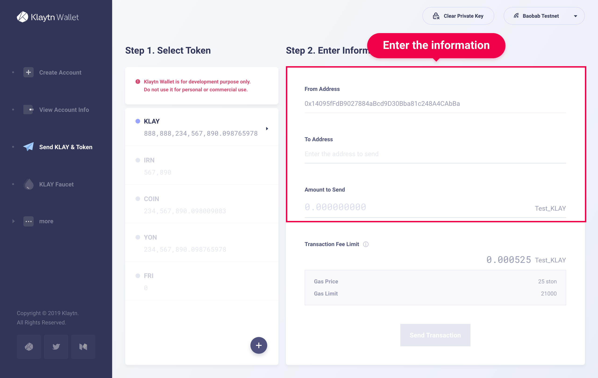

### 5단계: 전송을 확인하세요. 

확인 페이지가 나타나면 전송하려는 개수와 수신자의 주소를 다시 확인하세요. 잘 확인하였다면 `Yes, I'm sure` 버튼을 클릭하세요. 만약 올바르지 않은 정보가 있다면 이전 페이지로 돌아가 토큰 전송 정보를 수정할 수 있습니다.

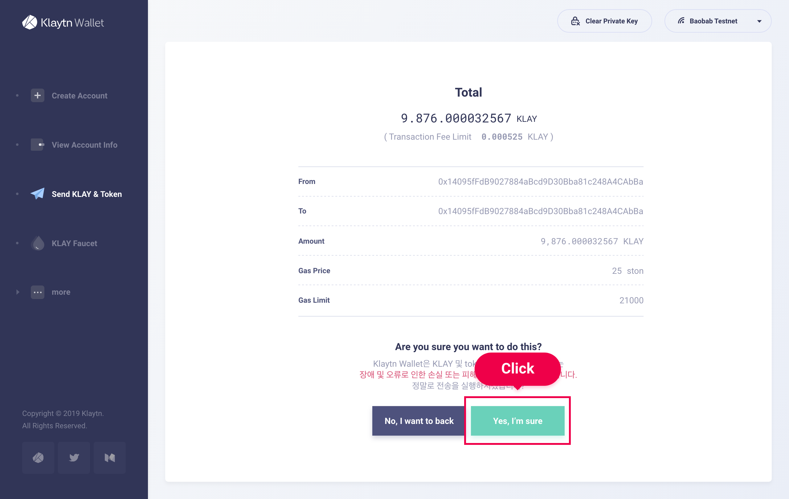

### 6단계: 전송 세부 사항을 검토하세요. 

이제 트랜잭션 요청이 완료되었습니다. Klaytnscope에서 트랜잭션의 상태를 확인할 수 있습니다. `View Transaction Info` 버튼을 클릭하면 Klaytnscope를 열어 트랜잭션의 세부 정보를 보여줍니다.

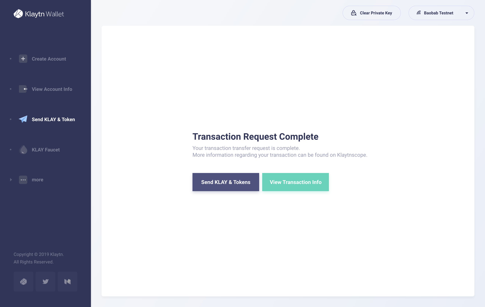

## Baobab 테스트넷 KLAY 받기 

테스트넷 KLAY Faucet은 Baobab 네트워크에서 실행 중입니다. The faucet can be accessed from the [Baobab Klaytn Wallet](https://baobab.wallet.klaytn.foundation).

테스트넷 KLAY를 받으려면, 유효한 Klaytn 계정이 있어야 합니다.

* 계정이 없다면 [새 계정 생성하기](#create-a-new-account)를 따라 계정을 만들어주세요.
* [기존 계정 접속하기](#access-existing-account)를 따라 지갑에 계정을 로드하세요. 테스트넷 KLAY는 로드된 계정으로 전송됩니다.

### 1단계: 테스트넷 KLAY Faucet으로 이동하세요. 

From the [Baobab Klaytn Wallet](https://baobab.wallet.klaytn.foundation), `KLAY Faucet` menu on the left bar brings you to the testnet KLAY request page.

요청된 페이지에서 현재 계정의 주소와 테스트넷 KLAY 잔액을 확인할 수 있습니다.

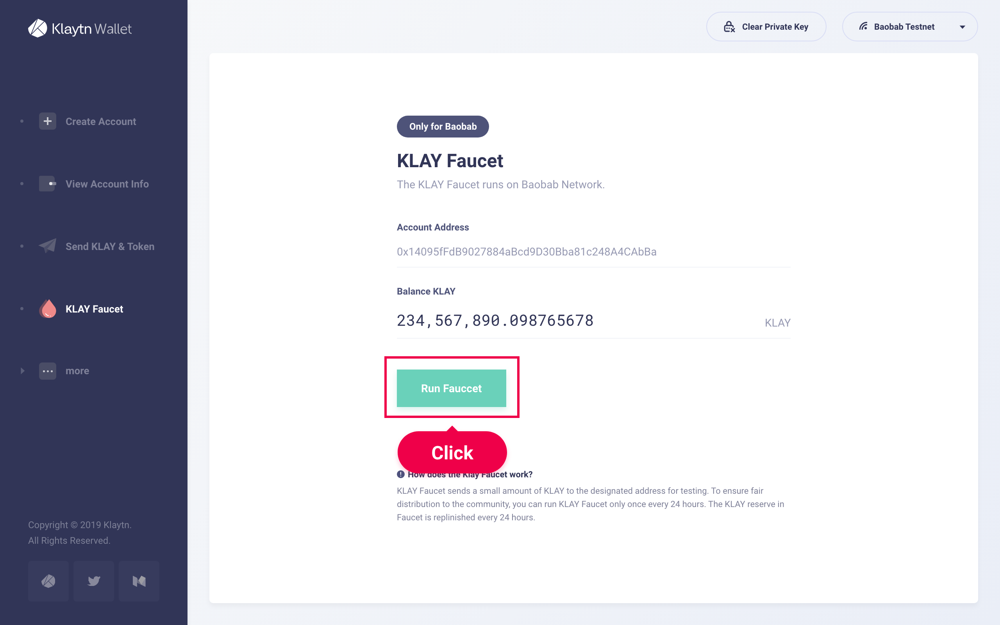

### 2단계: Faucet을 실행하세요. 

`Run Faucet` 버튼을 클릭하여 5 테스트넷 KLAY를 받으면 잔액이 업데이트됩니다. 24시간마다 한 번씩 각 계정에 대해 Faucet을 실행할 수 있습니다.
