# Klaytnscope 

Klaytnscope는 클레이튼 네트워크의 블록 탐색기입니다. Klaytnscope는 네트워크 상태를 모니터링하고 다양한 통계를 제공하여 Klaytn 네트워크에 대해 이해할 수 있게 도와줍니다. 또한 블록 및 트랜잭션 데이터와 Klaytn 네트워크의 스마트 컨트랙트 리스트도 탐색할 수 있습니다.

* Baobab 네트워크에 대한 자세한 내용은 [https://baobab.scope.klaytn.com](https://baobab.scope.klaytn.com)을 참고해주세요.
* 메인넷에 대한 자세한 내용은 [https://scope.klaytn.com](https://scope.klaytn.com)을 참고해주세요.

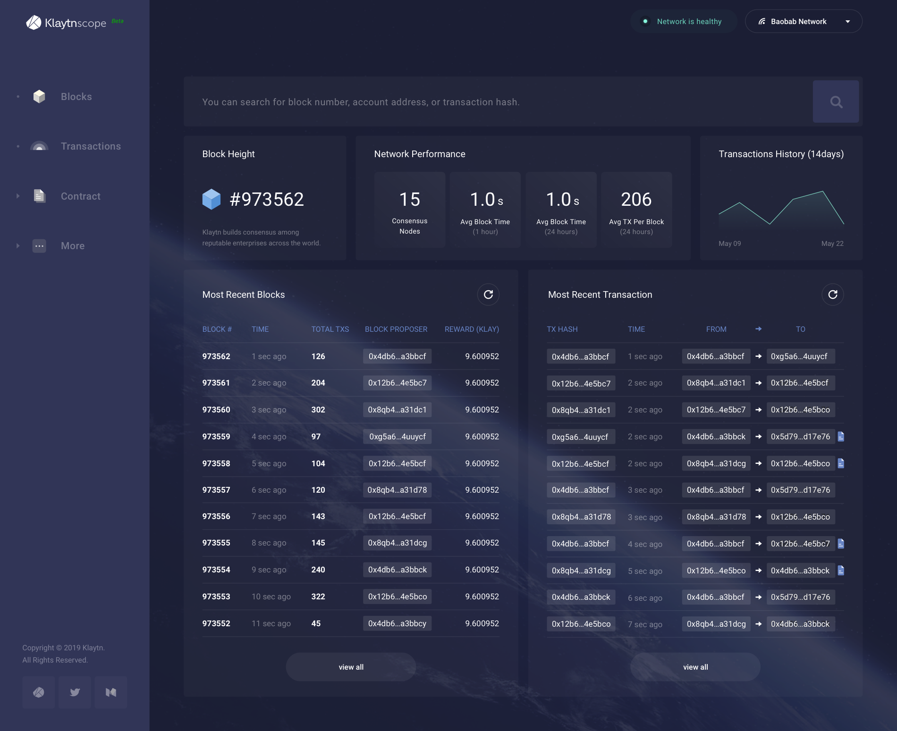

## 주요 기능 

일부 기능은 아직 개발 중입니다.

* 네트워크 개요
* 블록 검색
* 트랜잭션 검색
* 계정 검색
* 이벤트 로그 검색
* 블록 제안자 정보

이후 장에서는 Klaytnscope의 스크린샷과 함께 주요 기능들을 살펴보겠습니다. 기능들은 대시보드, 목록 보기, 상세 보기, 검색 등 네 개의 카테고리로 분류됩니다.

## 대시보드 

대시보드에는 네트워크 정보가 나타납니다. 즉 평균 블록 생성 시간, 블록당 평균 트랜잭션 수, 컨센서스 노드의 개수, 트랜잭션의 최근 추세를 제공합니다.

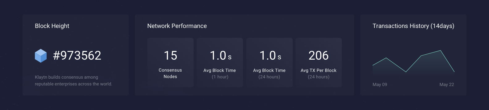

* Block Height: 최신 블록의 번호입니다. 즉 제네시스 블록으로부터 몇 개의 블록이 생성되었는지 나타냅니다.
* Network Performance: Klaytn 네트워크의 성능을 네 가지 지표로 나타냅니다.
  * Consensus Nodes: 위 그림에서는 15개의 노드가 합의에 참여하고 있습니다.
  * Avg Block Time \(1 hour\): 지난 한 시간 동안의 평균 블록 생성 시간입니다.
  * Avg Block Time \(24 hours\): 지난 24시간 동안의 평균 블록 생성 시간입니다.
  * Avg TX Per Block \(24 hours\): 지난 24시간 동안 한 블록에 담긴 트랜잭션의 평균 개수입니다.
* Transaction History \(14 days\): 지난 14일 동안 하루에 발생한 트랜잭션의 개수 그래프입니다. 지난 2주 동안 발생한 트랜잭션의 양에 대한 추세를 확인할 수 있습니다.

### Recent Blocks & Transactions 

이 목록들은 각각 최근에 생성된 블록과 트랜잭션을 나타냅니다. 우측 상단의 새로 고침 버튼을 클릭하여 최신 정보를 가져올 수 있습니다. 목록의 하단에 있는 ‘view all’ 버튼을 클릭하여 [목록 보기](klaytnscope.md#list-view)로 이동할 수 있습니다.

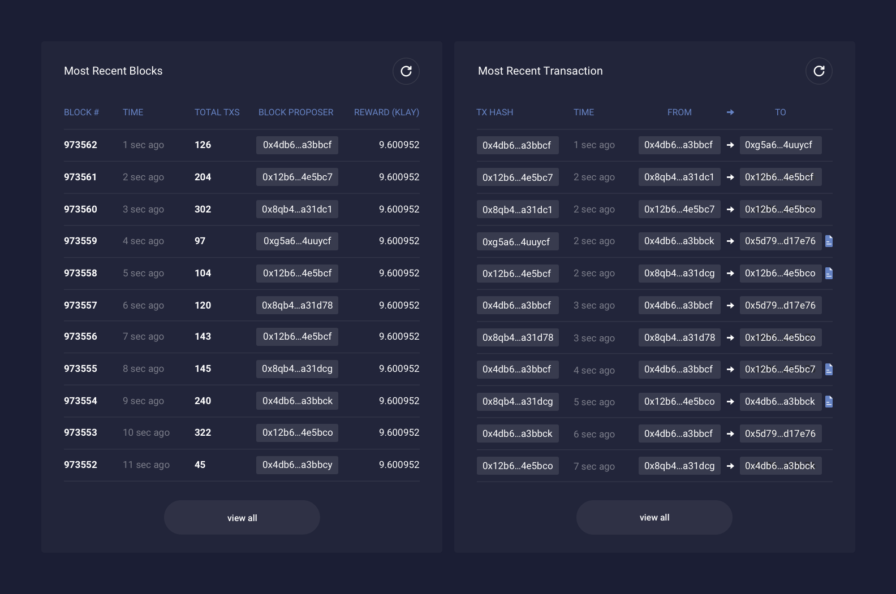

### 네트워크 상태 표시기 & 네트워크 선택 탭 

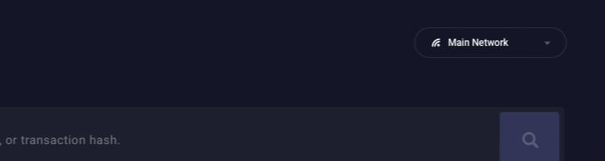

우측 상단에 네트워크 상태 표시기와 네트워크를 선택할 수 있는 탭이 있습니다.

* 네트워크 상태 표시기
  * Network is healthy: Klaytnscope가 정상적으로 작동하는 상태입니다. 네트워크 상태는 정상입니다.
  * Data latency: Klaytnscope가 시스템 유지 관리 중입니다. 데이터가 지연되고 있는 상태입니다.
  * Data accuracy: Klaytnscope가 데이터를 동기화하고 있는 상태이므로 잠시만 기다려주세요.
* 네트워크 선택 탭
  * 이 메뉴에서 Klaytn 메인넷과 Baobab 테스트넷을 선택할 수 있습니다.

## 목록 보기 

Klaytn 네트워크의 상태를 자세히 보려면 최근 생성된 블록과 트랜잭션 목록을 확인하세요. 목록 페이지로 이동하려면 화면 왼쪽의 탐색 모음에서 버튼을 클릭하세요.

### Blocks 

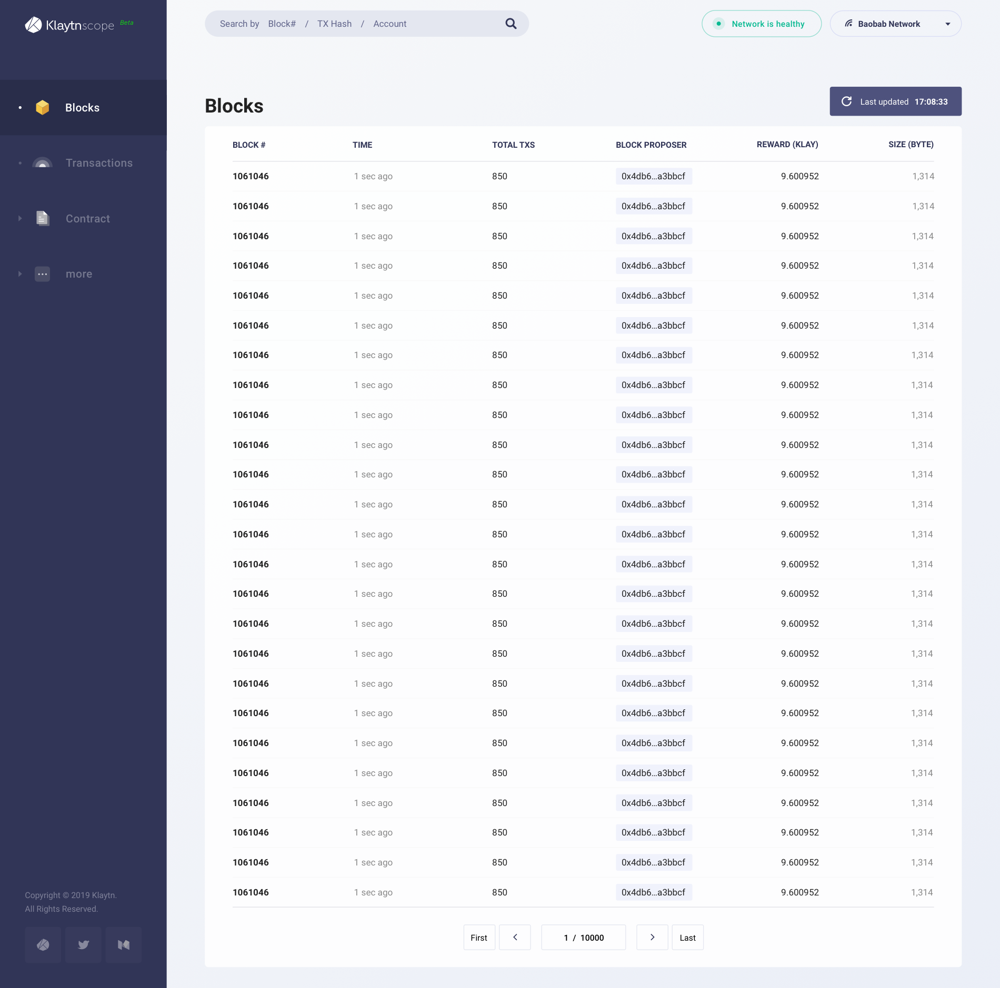

최근 생성된 블록들의 목록입니다. 정보를 업데이트하려면 새로 고침을 클릭하세요.

* Block: 블록의 고유 번호입니다. 0\(the genesis block\)부터 시작하여 블록이 생성될 때마다 순차적으로 부여받습니다.
* Time: 블록이 생성된 때부터 지금까지 지난 시간입니다. 여기에 마우스 포인터를 가져가면 정확한 날짜와 시간을 볼 수 있습니다.
* Total TXs: 블록에 담긴 트랜잭션의 개수입니다.
* Block Proposer: 블록을 제안한 컨센서스 노드입니다. 블록을 생성한 노드는 무작위적이지만 한편으론 결정론적으로 선택됩니다. 이 주소를 클릭하여 상세 보기 페이지로 쉽게 이동할 수 있습니다.
* Reward: 새로 발행된 KLAY \(9.6 KLAY\)와 블록에서 사용된 트랜잭션 수수료의 합계입니다. 이 목록에서는 Klaytn 거버넌스 카운슬 보상, 기여증명, Klaytn 개선 준비금의 합계만 나타납니다. 상세 정보를 보려면 블록 상세 보기 페이지의 블록 보상 장에 마우스 포인터를 가져가세요. More details about the block reward distribution system can be found in the [Klaytn Token Economy][].
* Size: 블록의 바이트 단위 크기입니다. 많은 트랜잭션이 담겨 있을수록 블록의 크기가 더 커집니다.

### Transactions 

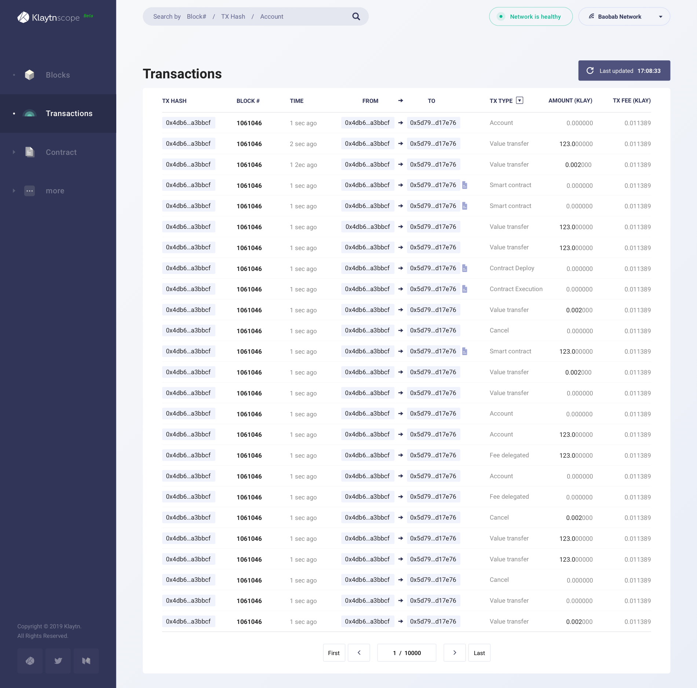

최근 실행된 트랜잭션의 목록입니다. 정보를 업데이트하려면 새로 고침을 클릭하세요.

* TX Hash: 트랜잭션의 고유 식별자입니다. 더 자세한 정보를 확인하려면 해시를 클릭하여 상세 보기 페이지로 이동하세요. 트랜잭션이 실패한 경우 옆에 빨간색 느낌표가 나타납니다.
* Block \#: 해당 트랜잭션을 담은 블록의 번호입니다. 번호를 클릭하여 해당 블록의 상세 보기 페이지로 이동할 수 있습니다.
* Time: 트랜잭션 실행으로부터 지금까지 지난 시간입니다. 여기에 마우스 포인터를 가져가면 정확한 날짜와 시간을 볼 수 있습니다.
* From -&gt; To: 트랜잭션 발신자와 수신자의 주소입니다. 이 주소를 클릭하여 상세 보기 페이지로 쉽게 이동할 수 있습니다. 주소 옆에 파일 아이콘이 표시되면 해당 주소는 컨트랙트의 주소입니다.
* TX Type: 트랜잭션의 유형입니다. 필터를 적용하여 특정 유형의 트랜잭션을 조회할 수 있습니다. For more information, please visit [Transactions][].
* Amount: 트랜잭션을 통해 전송된 금액입니다.
* TX Fee: 트랜잭션 처리에 소비된 실제 비용입니다.

## 상세 보기 

이 페이지를 통해 블록, 트랜잭션, 계정, 컨트랙트 하나씩의 자세한 정보를 확인할 수 있습니다. 상세 보기로 이동하려면 검색 창에서 검색하거나 목록 보기에서 항목을 클릭하세요.

### 블록 

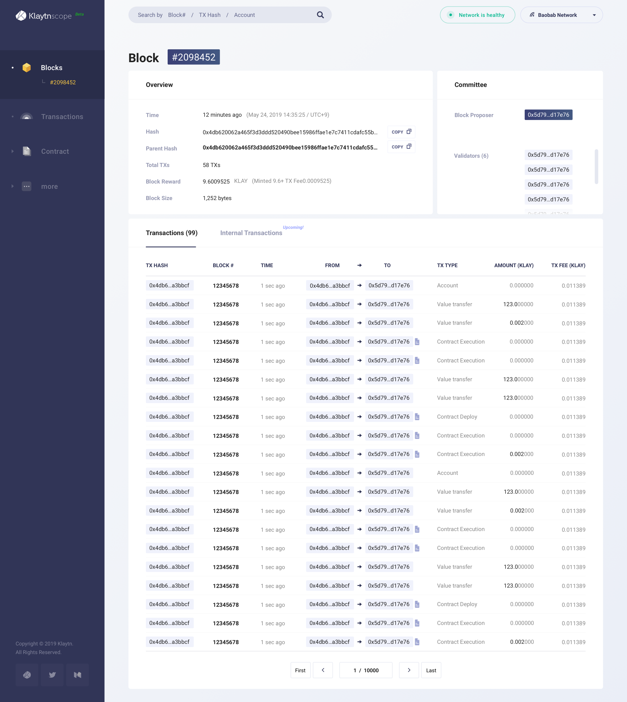

#### 개요 

블록에 대한 전반적인 정보입니다.

* Time: 블록 생성 후 경과한 시간입니다. 정확한 일시 또한 옆에 나타납니다.
* Hash: 블록의 고유 식별자입니다. 복사 버튼을 눌러 해시를 쉽게 복사할 수 있습니다.
* Parent Hash: 이전 블록의 고유 식별자입니다. 해시를 클릭하여 이전 블록 해시의 상세 보기 페이지로 이동할 수 있습니다.
* Total TXs: 블록에 담긴 트랜잭션의 개수입니다.
* Block Reward: 새로 발행된 KLAY \(9.6 KLAY\)와 블록에서 사용된 트랜잭션 수수료의 합계입니다. 마우스 포인터를 가져가면 Klaytn 거버넌스 카운슬 보상, 기여증명, Klaytn 개선 준비금에 대한 자세한 정보를 확인할 수 있습니다. More details about block reward distribution system can be found in the [Klaytn Token Economy][].
* Block Size: 블록의 바이트 단위 크기입니다. 많은 트랜잭션이 담겨 있을수록 블록의 크기가 더 커집니다.

#### Committee 

블록을 제안하고 검증하는 컨센서스 노드의 목록입니다.

* Block Proposer: 블록을 제안한 컨센서스 노드입니다. 블록을 생성한 노드는 무작위적이지만 한편으론 결정론적으로 선택됩니다. 이 주소를 클릭하여 노드의 상세 보기 페이지로 쉽게 이동할 수 있습니다.
* Validators: 블록을 검증하는 컨센서스 노드입니다. 이 주소를 클릭하여 노드의 상세 보기 페이지로 쉽게 이동할 수 있습니다.

#### Transactions 

블록에 담긴 트랜잭션들의 목록입니다.

### 트랜잭션(Transaction)

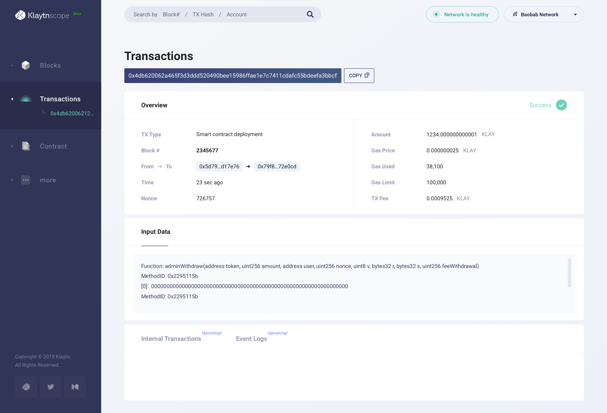

#### 개요 

트랜잭션에 대한 전반적인 정보입니다.

* Status indicator: 우측 상단에 있습니다. 트랜잭션의 성공 여부를 나타냅니다.
* TX Type: 트랜잭션의 유형입니다. For more information, please see [Transactions][].
* Block \#: 해당 트랜잭션을 담은 블록의 번호입니다. 번호를 클릭하여 해당 블록의 상세 보기 페이지로 이동할 수 있습니다.
* From -&gt; To: 트랜잭션 발신자와 수신자의 주소입니다. 이 주소를 클릭하여 계정의 상세 보기 페이지로 쉽게 이동할 수 있습니다. 주소 옆에 파일 아이콘이 표시되면 해당 주소는 컨트랙트의 주소입니다.
* Fee Payer: 트랜잭션 수수료가 전부 혹은 부분적으로 위임된 트랜잭션의 경우 표시됩니다. 이 주소를 클릭하여 계정의 상세 보기 페이지로 쉽게 이동할 수 있습니다.
* Time: 트랜잭션 실행으로부터 지금까지 지난 시간입니다.
* Nonce: 해당 발신자의 주소에서 전송한 트랜잭션의 개수입니다. 0부터 시작하여 트랜잭션이 전송될 때마다 순차적으로 1씩 증가합니다.
* Amount: 트랜잭션을 통해 전송된 금액입니다.
* Gas Price: 가스당 KLAY 가격입니다. 이 값은 Klaytn 네트워크에서 고정되어 있습니다.
* Gas Used: 트랜잭션을 실행하는 데에 소비된 정확한 가스양입니다.
* Gas Limit: 트랜잭션 발신자가 트랜잭션을 실행하는 데에 지불하고자 하는 가스양의 한도입니다.
* TX Fee: 트랜잭션 처리에 소비된 실제 비용입니다. Gas Price와 Gas Used 값의 곱으로 계산합니다.
* TX Fee by Sender: 트랜잭션의 비용이 부분적으로 위임된 트랜잭션의 경우 표시됩니다. 트랜잭션 수수료 중 트랜잭션 발신자가 지불한 몫입니다.
* TX Fee by Fee Payer: 트랜잭션의 비용이 부분적으로 위임된 트랜잭션의 경우 표시됩니다. 트랜잭션 수수료 중 트랜잭션 수수료 납부자가 지불한 몫입니다.

#### Input Data 

트랜잭션 발신자나 컨트랙트에 의해 입력된 추가 데이터입니다.

### 계정 

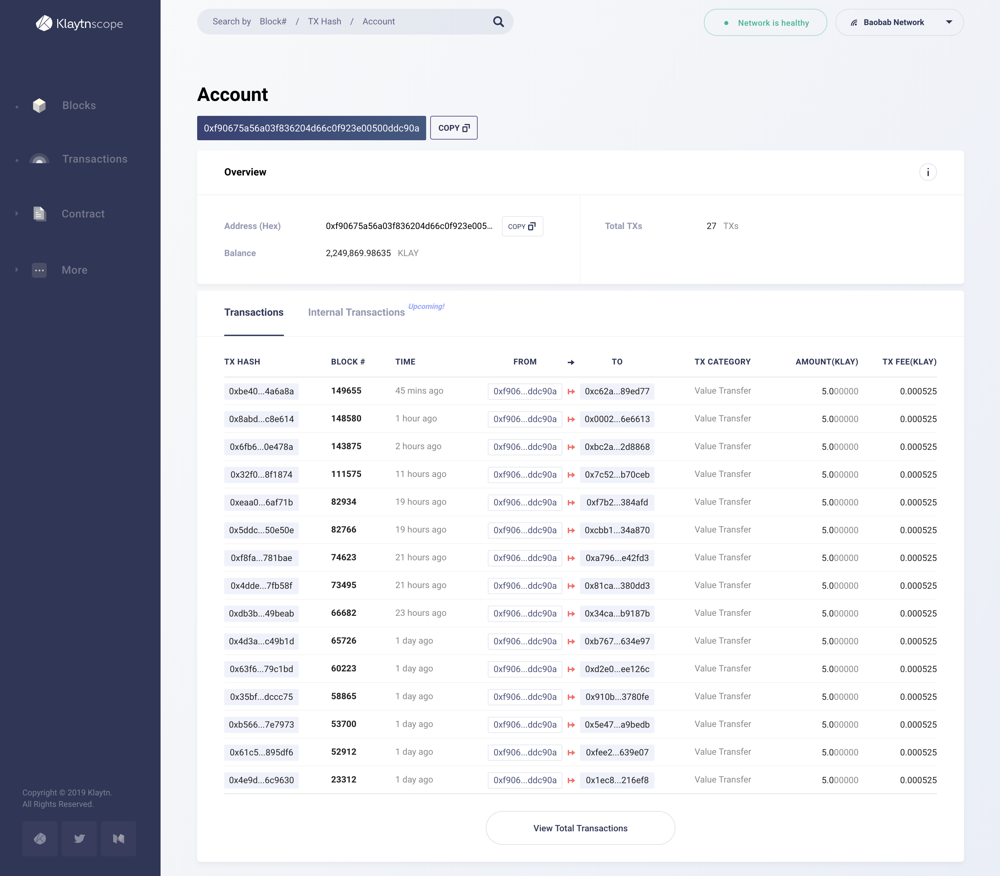

#### 개요 

계정에 대한 전반적인 정보입니다.

* Address \(Hex\): 계정의 고유 주소입니다.
* Balance: 계정이 가진 총 KLAY 양입니다.
* Total TXs: 계정이 보내거나 받은 트랜잭션의 총 개수입니다.
* HRA: 계정 유형이 HRA인지 여부를 나타냅니다. \(TBD\)

#### Transactions 

계정과 관련된 트랜잭션의 목록입니다. 화살표의 색은 이 계정이 발신자인지 수신자인지 나타냅니다.

### Contract 

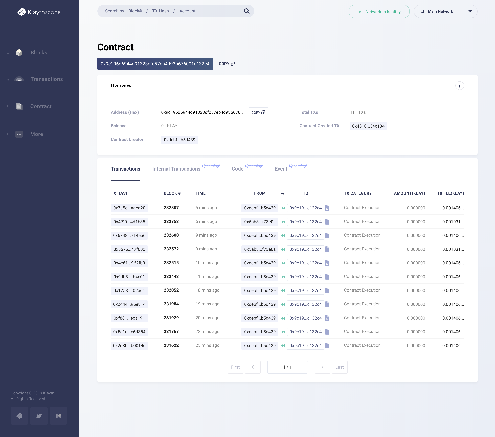

#### 개요 

컨트랙트에 대한 전반적인 정보입니다.

* Account \(Hex\): 컨트랙트의 고유 주소입니다.
* Balance: 컨트랙트가 가진 총 KLAY 양입니다.
* Contract Creator: 컨트랙트를 배포한 계정입니다. 이 주소를 클릭하여 계정의 상세 보기 페이지로 쉽게 이동할 수 있습니다.
* Total TXs: 컨트랙트가 받은 트랜잭션의 총 개수입니다.
* Contract Created TX: 컨트랙트를 배포한 트랜잭션입니다. 해시를 클릭하여 트랜잭션의 상세 보기 페이지로 이동할 수 있습니다.
* HRA: 컨트랙트 계정의 유형이 HRA인지 여부를 나타냅니다. \(TBD\)

#### Transactions 

컨트랙트와 관련된 트랜잭션의 목록입니다.

## 검색 

Klaytnscope를 통해 계정, 컨트랙트, 트랜잭션, 블록에 대한 정보를 검색할 수 있습니다. 모든 페이지에 검색 창이 있어 쉽게 접근할 수 있습니다. 검색 대상의 키워드가 잘 입력되었다면 검색 대상의 상세 보기 페이지로 이동합니다.

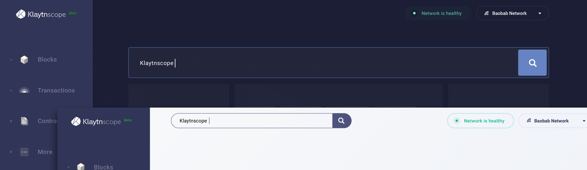

### 검색 키워드 

메인넷 버전에서 검색 가능한 키워드는 다음과 같습니다.

* 블록 번호
* 트랜잭션 해시
* 주소 \(계정, 컨트랙트\)
* Human Readable Address \(.klaytn\) \(TBD\)

### 키워드 형식 

각 키워드의 특징은 다음과 같습니다.

#### 블록 

* 10진수만 가능합니다. \[0~9\]

#### 트랜잭션 해시 

* 66자입니다.
* `0x`로 시작합니다.
* 16진수만 가능합니다. \[0~9, a~f\]

#### 계정의 주소입니다.

* 42자입니다.
* `0x`로 시작합니다.
* 16진수만 가능합니다. \[0~9, a~f\]

#### Human Readable Address \(TBD\) 

* 12~20자입니다.
* `.klaytn`으로 끝납니다.

### 검색 오류 

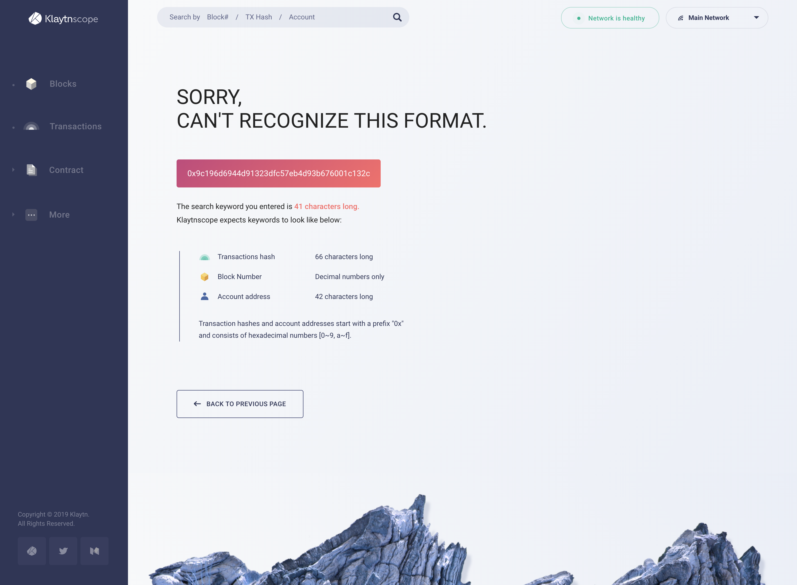

지정된 형식에 맞지 않는 키워드를 검색하거나 검색한 내용에 해당하는 결과가 없는 경우 검색 결과가 나타나지 않습니다.

#### 잘못된 형식 \(트랜잭션 해시 / 주소\) 

* 검색한 키워드의 글자 수가 잘못된 경우
* 검색 키워드가 `0x`로 시작하지 않은 경우
* 검색 키워드에 특수 문자나 16진수가 아닌 문자가 포함된 경우 \[g~z\]

#### 검색 결과 없음 

* 검색 키워드에 해당하는 블록이 아직 생성되지 않은 경우 \(검색한 블록 번호가 현재 블록 번호보다 더 이후인 경우\)
* 검색 키워드가 존재하지 않는 트랜잭션 해시인 경우

[Transactions]: ../klaytn/design/transactions/README.md
[Klaytn Token Economy]: ../klaytn/design/token-economy.md
