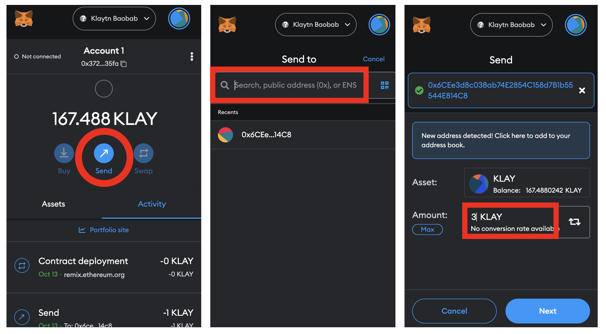

# Đang kết nối đến MetaMask

> **Lưu ý**: MetaMask chủ yếu được sử dụng làm ví cho Ethereum, nhưng nó cũng tương thích với Klaytn vì có cấu trúc địa chỉ đồng nhất. Klaytn cũng có ví dạng tiện ích mở rộng của trình duyệt gọi là [Kaikas](../developer-tools/#kaikas), nên về cơ bản nó cũng cung cấp các tính năng giống với MetaMask, không kể Remix.

## Bước 1. Cài đặt MetaMask 

* Chúng tôi sẽ sử dụng trình duyệt Chrome trong ví dụ này. ([**Cài đặt Chrome**](https://www.google.com/intl/en\_us/chrome/))
*   Thêm [**Tiện ích mở rộng MetaMask**](https://chrome.google.com/webstore/detail/metamask/nkbihfbeogaeaoehlefnkodbefgpgknn?hl=en) vào Chrome.

    > **Lưu ý:** Bạn có thể cần cài đặt thêm nếu đang sử dụng trình duyệt khác.
* Bạn có thể khởi động MetaMask bằng cách nhấn vào biểu tượng góc trên bên phải của trình duyệt chrome.

## Bước 2. Tạo Ví MetaMask 

* Nhấn vào \[Tạo Ví].
* Đặt mật khẩu.
*   Bạn sẽ nhận được một cụm từ khôi phục gồm 12 từ; lưu dự phòng nó ở nơi an toàn.

    > **Lưu ý:** Bạn chỉ có thể khôi phục lại ví của mình với cụm từ khôi phục. Chia sẻ cụm từ khôi phục với người khác có thể dẫn đến mất toàn bộ số tiền quỹ của bạn. Vì vậy, chúng tôi khuyên bạn nên hoặc là viết ra bằng tay hoặc lưu lại ở một thiết bị ngoại tuyến.

## Bước 3. Kết nối với Mạng lưới Cypress Klaytn (Mainet) 

> Có một cách dễ làm. [Kết nối ví của bạn với Mạng lưới Cypress Klaytn (Mainnet)](https://chainlist.org/chain/8217).

* Nhấn vào tab Networks phía trên, mặc định có trên Mainnet Ethereum, và chọn \[Thêm mạng lưới].
* Nhập dữ liệu Nút điểm cuối (EN) của chuỗi Klaytn.
  * Cypress
    * Tên Mạng: Cypress Klaytn
    * URL RPC mới: (Mặc định: [https://public-en-cypress.klaytn.net](https://public-en-cypress.klaytn.net))
    * URL Trình khám phá Block: [https://scope.klaytn.com/](https://scope.klaytn.com/)
    * ID Chuỗi: 8217
    * Ký hiệu Tiền tệ: KLAY
* Nhấn \[Save] để thêm Mạng Cypress Klaytn.

 

## Bước 4. Send KLAY 

**Lưu ý:** Các bước tiếp theo yêu cầu phải có KLAY.

* Nhấn \[Send] trên trang chính và nhập vào địa chỉ người nhận và số lượng KLAY.

**LƯU Ý:** Gửi KLAY yêu cầu có một giao dịch, nên bạn cần KLAY cho giao dịch đó.

* Vì Klaytn v1.9.0, một [cơ chế phí gas động](https://medium.com/klaytn/dynamic-gas-fee-pricing-mechanism-1dac83d2689) đã thay thế chính sách giá cố định hiện có.
* Vậy nên bạn không phải đặt phí gas cố định thủ công.
* Kiểm tra số lượng sẽ gửi đi và phí giao dịch và nhấn \[Confirm] để hoàn tất việc chuyển KLAY, sau đó bạn sẽ được chuyển đến trang chính.
* Nhấn \[Activity] trên trang chính để xác nhận lịch sử giao dịch.

## Kết nối với Mạng lưới Baobab (Testnet) 

### Nhận KLAY để thực hiện giao dịch

> **Lưu ý:** Bài hướng dẫn này sử dụng EN Công khai của Testnet (Baobab) để kết nối với mạng này. Hãy nhớ sử dụng Baobab khi bạn chạy thử.

> Có một cách dễ làm. [Kết nối ví của bạn với Mạng lưới Baobab Klaytn (Testnet)](https://chainlist.org/chain/1001).

* Baobab
  * Tên Mạng: Baobab Klaytn
  * URL RPC mới: [https://public-en-baobab.klaytn.net](https://public-en-baobab.klaytn.net)
  * URL Trình khám phá Block: [https://baobab.scope.klaytn.com/](https://baobab.scope.klaytn.com/)
  * ID Chuỗi: 1001
  * Ký hiệu Tiền tệ: KLAY
* Nhấn \[Save] để thêm Mạng Baobab Klaytn.

* Để thử kết nối của Ví Klaytn, bạn sẽ cần thực hiện giao dịch có yêu cầu KLAY.
* Nhấn vào menu kebab (ba chấm) ở góc trên bên phải và chọn \[Thông tin Tài khoản].
* Nhấn \[Xuất Khóa riêng tư] để lấy khóa riêng tư của bạn.

* Khi sử dụng Testnet Baobab, bạn có thể nhận được Klay Thử trong [**Faucet Klaytn**](https://baobab.wallet.klaytn.foundation/access?next=faucet).
* Nhập khóa riêng tư của bạn vào Ví Klaytn và nhấn vào \[Access] để đăng nhập. (Gắn 0x vào trước khóa riêng tư.)
* Nhấn \[Run Faucet]. 150 KLAY Testnet sẽ được gửi tới tài khoản của bạn và số dư sẽ được cập nhật tương ứng. Bạn có thể nhận KLAY Testnet từ Faucet một lần trong 24 giờ cho mỗi tài khoản.

* Quay lại MetaMask và xác nhận KLAY bạn đã nhận được.

