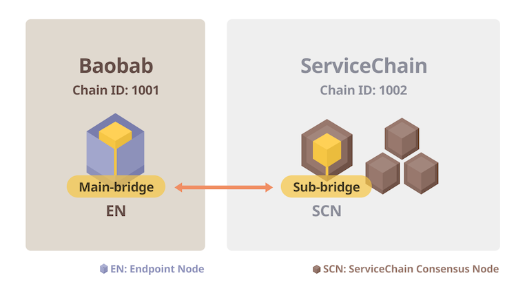

Phần này trình bày cách kết nối mạng lưới Chuỗi dịch vụ 4 nút của bạn với mạng lưới Baobab. Bạn sẽ thiết lập EN Baobab và kết nối EN đó với một trong các SCN của bạn. Sau đó, bạn sẽ kích hoạt tính năng neo để đưa thông tin khối Chuỗi dịch vụ vào mạng lưới Baobab.



## Điều kiện tiên quyết <a id="prerequisites"></a>
 - 1 máy chủ Linux hoặc MacOS cho EN
 - Yêu cầu phần cứng tối thiểu cho việc thử nghiệm
   - CPU: 4-core (Intel Xeon hoặc tương đương), RAM: 16GB, HDD: 50GB
   - Vui lòng tham khảo [Yêu cầu hệ thống](../references/system-requirements.md) để biết thêm chi tiết.
 - Tải xuống tập tin thực thi EN Baobab. Để biết danh sách đầy đủ các tập tin nhị phân có thể tải về, hãy xem [Tải về](../../../download/README.md).
 - Giả định và hạn chế
   - Một mạng lưới Chuỗi dịch vụ đã được cài đặt và đang chạy. Vui lòng tham khảo [Thiết lập Chuỗi dịch vụ 4 nút](4nodes-setup-guide.md) để thiết lập mạng lưới.
   - Một EN Baobab.
   - Một EN chỉ có thể kết nối với một SCN vì hệ thống chỉ hỗ trợ kết nối một-một.
   - Mọi SCN không cần phải kết nối với EN.

## Bước 0: Cài đặt EN Baobab <a id="install-baobab-en"></a>
Quá trình cài đặt chính là giải nén gói đã tải xuống. Giải nén tập tin lưu trữ trên mỗi máy chủ EN.

```bash
EN-01$ tar xvf ken-baobab-vX.X.X-XXXXX-amd64.tar.gz
```

## Bước 1: Chuẩn bị genesis.json <a id="step-1-preparing-genesis-json"></a>
Từ máy chủ EN, tải về `genesis.json` cho mạng lưới `Baobab`.
```
EN-01$ curl -X GET https://packages.klaytn.net/baobab/genesis.json -o ~/genesis.json
```

## Bước 2: Khởi tạo nút EN <a id="step-2-en-node-initialization"></a>
Bây giờ, chúng ta sẽ khởi tạo nút EN bằng tệp khởi nguyên. Thực thi các lệnh sau. Điều này sẽ tạo thư mục dữ liệu lưu trữ dữ liệu chuỗi và nhật ký trên thư mục chủ của bạn. Bạn có thể thay đổi thư mục dữ liệu bằng lệnh dẫn hướng `--datadir`.

```
EN-01$ ken --datadir ~/data init ~/genesis.json
```

## Bước 3: Định cấu hình nút EN <a id="step-3-configure-the-en-node"></a>
Chuyển đến thư mục cài đặt ken và đổi tên `mv kend_baobab.conf kend.conf`, rồi chỉnh sửa `conf/kend.conf` như sau.

```
...
NETWORK="baobab"
...
SC_MAIN_BRIDGE=1
...
DATA_DIR=~/data
...
```

## Bước 4: Bắt đầu nút EN <a id="step-4-start-the-en-node"></a>
```
EN-01$ kend start
Starting kscnd: OK
```
Bạn có thể kiểm tra trạng thái đồng bộ bằng cách xem `klay.blockNumber`. Nếu số này không phải là 0 thì nút đang hoạt động bình thường. Việc tải về tất cả các khối trên mạng lưới Baobab có thể mất nhiều thời gian tùy thuộc vào điều kiện mạng lưới và hiệu suất phần cứng, vì vậy chúng tôi khuyên bạn nên sử dụng [Đồng bộ nhanh](../../endpoint-node/installation-guide/configuration.md) để đồng bộ hóa các khối.
```
EN-01$ ken attach --datadir ~/data
> klay.blockNumber
21073
```
Nếu bạn muốn dừng một nút, bạn có thể sử dụng lệnh `kend stop`

## Bước 5: Kiểm tra KNI của nút EN <a id="step-5-check-kni-of-en-node"></a>
Lưu ý KNI của EN-01 là thông tin được sử dụng để kết nối từ nút SCN-L2-01. Giá trị này sẽ được sử dụng trong bước tiếp theo khi tạo `main-bridges.json`.
```
EN-01$ ken attach --datadir ~/data
> mainbridge.nodeInfo.kni
"kni://0f7aa6499553...25bae@[::]:50505?discport=0"
```


## Bước 6: Tạo main-bridges.json <a id="step-6-create-main-bridges-json"></a>
Đăng nhập vào SCN-L2-01 (lưu ý: không phải nút EN-01) và tạo `main-bridges.json` trên `~/data`. Thay thế `[::]` nằm sau chữ cái `@` bằng địa chỉ IP của nút EN-01.
```
SCN-L2-01$ echo '["kni://0f7aa6499553...25bae@192.168.1.1:50505?discport=0"]' > ~/data/main-bridges.json
```

## Bước 7: ĐỊnh cấu hình SCN rồi Khởi động lại kscn <a id="step-7-configure-scn-then-restart-kscn"></a>
Từ shell của nút SCN-L2-01, hãy chỉnh sửa `kscn-XXXXX-amd64/conf/kscnd.conf`. Nếu `SC_SUB_BRIDGE` được đặt thành 1, quá trình neo dữ liệu sẽ tự động bắt đầu khi nút SCN-L2-01 bắt đầu. Trong ví dụ này, `SC_PARENT_CHAIN_ID` được đặt thành 1001 vì `chainID` của chuỗi gốc, Baobab, là 1001. `SC_ANCHORING_PERIOD` là tham số quyết định khoảng thời gian gửi tx neo tới chuỗi chính. Bằng cách đặt giá trị thành 10, bạn đã định cấu hình nút để thực hiện việc neo sau mỗi 10 khối. Giá trị mặc định là 1.
```
...
SC_SUB_BRIDGE=1
...
SC_PARENT_CHAIN_ID=1001
...
SC_ANCHORING_PERIOD=10
...
```

Restart kscn by executing the following command:
```
SCN-L2-01$ kscnd stop
Shutting down kscnd: Killed
SCN-L2-01$ kscnd start
Starting kscnd: OK
```

Check if the SCN-L2-01 is connected to the EN-01 by checking `subbridge.peers.length`
```
SCN-L2-01$ kscn attach --datadir ~/data
> subbridge.peers.length
1
```

## Anchoring  <a id="anchoring"></a>
After finishing the EN-01 and SCN-L2-01 connection, you can log ServiceChain block information on the parent chain via Anchoring. In this section, you will top up a parent operator account, enable Anchoring, and check the anchored block number.

### Step 1: Get KLAY to test anchoring <a id="step-1-get-klay-to-test-anchoring"></a>
Anchoring requires SCN-L2-01 to make an anchoring transaction to Baobab. So `subbridge.parentOperator` account should have enough KLAY to pay the transaction fee. Get some KLAY from [Baobab Wallet Faucet](https://baobab.wallet.klaytn.foundation/) and transfer some KLAY to the `parentOperator`. For data anchoring in real service, `parentOperator` needs to have enough KLAY for transaction fee.

```
SCN-L2-01$ kscn attach --datadir ~/data
> subbridge.parentOperator
"0x3ce216beeafc62d20547376396e89528e1d778ca"
```


### Step 2: Start Anchoring <a id="step-2-start-anchoring"></a>
To start anchoring, execute the following command:
```
SCN-L2-01$ kscn attach --datadir ~/data
> subbridge.anchoring(true)
true
```
After anchoring starts, you can check the latest block anchored to Baobab by using `subbridge.latestAnchoredBlockNumber`. Please note that this only works after the EN already followed up on the latest block of Baobab. By default, SCN-L2-01 tries anchoring on every block from the block on which anchoring is turned on. The anchoring period can be set by changing `SC_ANCHORING_PERIOD`. If the value is set to 10, the node tries anchoring when the block number is a multiple of 10.
```
SCN-L2-01$ kscn attach --datadir ~/data
> subbridge.latestAnchoredBlockNumber
100
```

