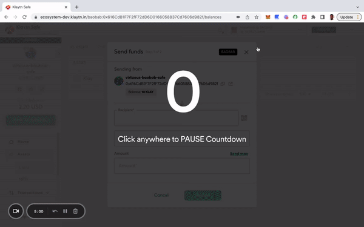

Trong phần này, bạn sẽ tìm hiểu cách gửi token KLAY và KIP-7 từ tài khoản Klaytn Safe.

## Gửi KLAY 

**Bước 1:** Nhấp vào nút **“New Transaction”** trong menu bên và chọn **“Send funds”** để bắt đầu chuyển tài sản mới.

**Bước 2:** Chọn tài sản cần chuyển.

* **KLAY** Lưu ý: Thêm **địa chỉ người nhận** và **số lượng** KLAY để gửi chuyển KLAY.

* **Token KIP-7** Lưu ý: Thêm địa chỉ người nhận và số lượng token để chuyển token KIP7.

**Bước 3:** Xem lại và gửi giao dịch. Bạn sẽ cần ký giao dịch bằng ví người ký của mình và sẽ được thực hiện sau khi đạt đến ngưỡng xác nhận.

## Gửi NFT 

Trong phần này, bạn sẽ tìm hiểu cách gửi token non-fungible từ tài khoản Klaytn Safe.

**Bước 1:** Nhấp vào nút **“New Transaction”** trong menu bên và chọn **“Send NFT”** để bắt đầu chuyển tài sản mới.

**Bước 2:** Chọn tài sản cần chuyển.

**Bước 3:** Xem lại và gửi giao dịch. Bạn sẽ cần ký giao dịch bằng ví người ký của mình và sẽ được thực hiện sau khi đạt đến ngưỡng xác nhận.

